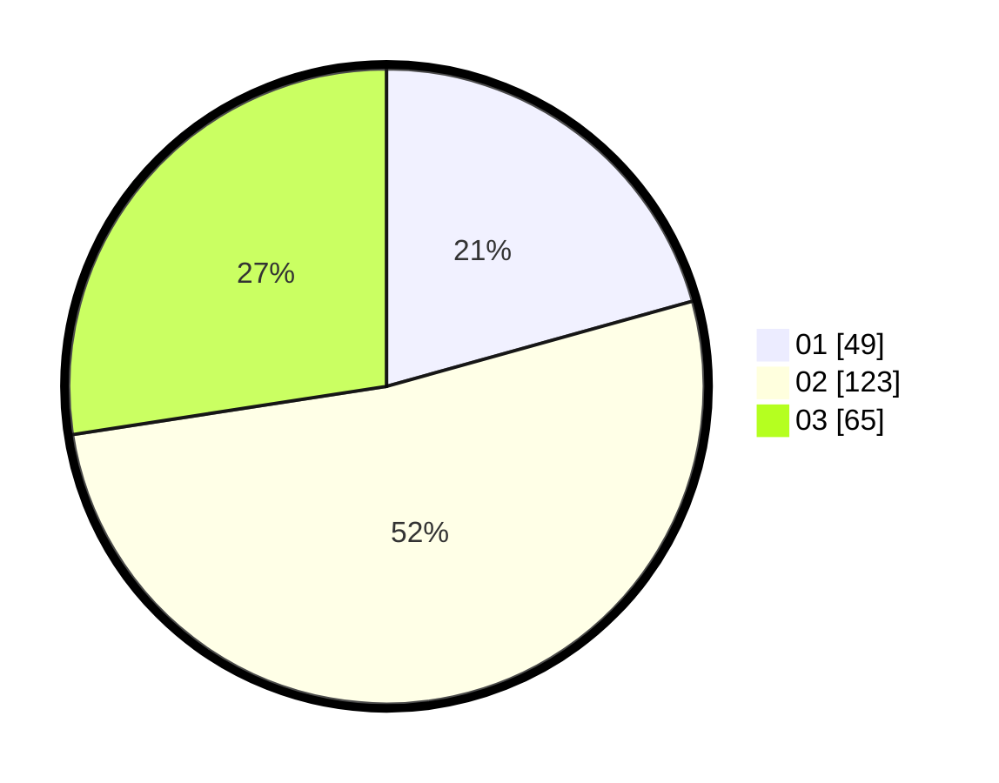

# Hasil

Hasil perolehan suara paslon dapat dilihat pada file paslon-01.txt, paslon-02.txt, dan paslon-03.txt.

Jika tidak ada, artinya data tersebut belum ada pada SIREKAP.

## Perolehan Suara

 * Paslon 01: **49**.
 * Paslon 02: **123**.
 * Paslon 03: **65**.

## Foto C Plano

https://sirekap-obj-formc.kpu.go.id/6c52/pemilu/ppwp/31/73/01/10/05/3173011005010-20240214-202658--c3710202-808c-4dd7-b0ed-8192135a926a.jpg

https://sirekap-obj-formc.kpu.go.id/6c52/pemilu/ppwp/31/73/01/10/05/3173011005010-20240214-201742--e071f0de-83bb-4315-9d04-a5e0afa63bb6.jpg

https://sirekap-obj-formc.kpu.go.id/6c52/pemilu/ppwp/31/73/01/10/05/3173011005010-20240214-201559--b460f4a8-ca85-4880-8dee-a799199cb5c6.jpg
