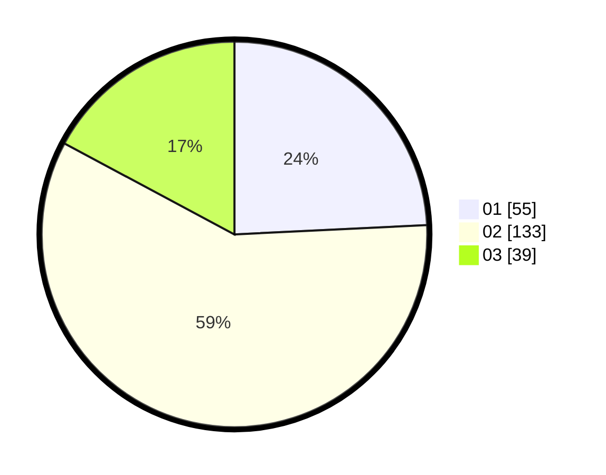

# Hasil

Hasil perolehan suara paslon dapat dilihat pada file paslon-01.txt, paslon-02.txt, dan paslon-03.txt.

Jika tidak ada, artinya data tersebut belum ada pada SIREKAP.

## Perolehan Suara

 * Paslon 01: **55**.
 * Paslon 02: **133**.
 * Paslon 03: **39**.

## Foto C Plano

https://sirekap-obj-formc.kpu.go.id/d940/pemilu/ppwp/31/73/01/10/05/3173011005013-20240215-000349--9ca1b416-5d4f-4bb7-885d-9ccbe491e9d3.jpg

https://sirekap-obj-formc.kpu.go.id/d940/pemilu/ppwp/31/73/01/10/05/3173011005013-20240215-000552--5706f0c0-266e-401f-ab84-b7deae4c4678.jpg

https://sirekap-obj-formc.kpu.go.id/d940/pemilu/ppwp/31/73/01/10/05/3173011005013-20240215-000646--ec7dd3dd-b35b-4420-b0b8-c6dd86839fdb.jpg
