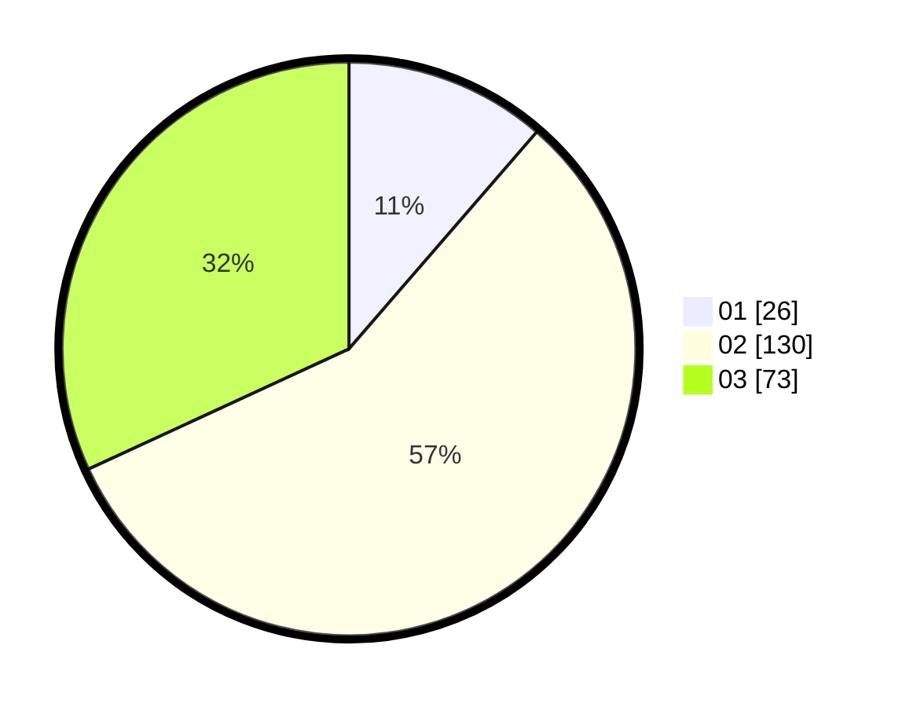

# Hasil

Hasil perolehan suara paslon dapat dilihat pada file paslon-01.txt, paslon-02.txt, dan paslon-03.txt.

Jika tidak ada, artinya data tersebut belum ada pada SIREKAP.

## Perolehan Suara

 * Paslon 01: **26**.
 * Paslon 02: **130**.
 * Paslon 03: **73**.

## Foto C Plano

https://sirekap-obj-formc.kpu.go.id/1ed7/pemilu/ppwp/31/73/01/10/05/3173011005017-20240214-220826--e40a5ba3-f884-4be6-a04e-99ac5e0aec27.jpg

https://sirekap-obj-formc.kpu.go.id/1ed7/pemilu/ppwp/31/73/01/10/05/3173011005017-20240214-141633--e1aaa21f-acd4-47cc-ac2c-f7c9c8aee840.jpg

https://sirekap-obj-formc.kpu.go.id/1ed7/pemilu/ppwp/31/73/01/10/05/3173011005017-20240214-221246--bfd3a5ec-c822-4177-a938-a19b2534231d.jpg
