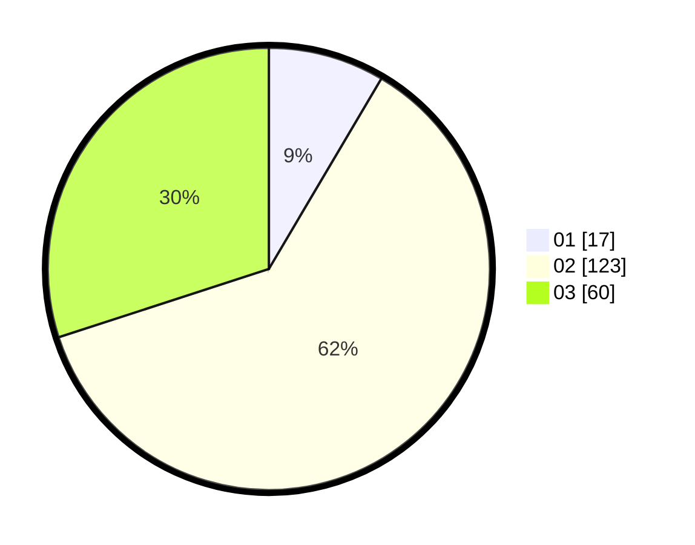

# Hasil

Hasil perolehan suara paslon dapat dilihat pada file paslon-01.txt, paslon-02.txt, dan paslon-03.txt.

Jika tidak ada, artinya data tersebut belum ada pada SIREKAP.

## Perolehan Suara

 * Paslon 01: **17**.
 * Paslon 02: **123**.
 * Paslon 03: **60**.

## Foto C Plano

https://sirekap-obj-formc.kpu.go.id/f68d/pemilu/ppwp/31/73/01/10/05/3173011005019-20240215-001450--3824d322-b80f-4d13-94c7-438cabc9eb0d.jpg

https://sirekap-obj-formc.kpu.go.id/f68d/pemilu/ppwp/31/73/01/10/05/3173011005019-20240216-042621--37493d3b-6daa-4ee3-9d3c-bd6ef6c85dff.jpg

https://sirekap-obj-formc.kpu.go.id/f68d/pemilu/ppwp/31/73/01/10/05/3173011005019-20240216-120723--80523d70-dd6b-4f49-9093-fe49343924eb.jpg

## DATA PEMILIH TETAP

Jumlah pemilih dalam DPT: **292**.
 * L: **147**.
 * P: **145**.

## DATA PENGGUNA HAK PILIH

Jumlah pengguna hak pilih dalam DPT: **201**.
 * L: **93**.
 * P: **108**.

Jumlah pengguna hak pilih dalam DPTb: **0**.
 * L: **0**.
 * P: **0**.

Jumlah pengguna hak pilih dalam DPK: **2**.
 * L: **1**.
 * P: **1**.

Jumlah pengguna hak pilih: **203**.
 * L: **94**.
 * P: **109**.

## JUMLAH SUARA SAH DAN TIDAK SAH

JUMLAH SELURUH SUARA SAH: **200**.

JUMLAH SUARA TIDAK SAH: **3**.

JUMLAH SELURUH SUARA SAH DAN SUARA TIDAK SAH: **203**.
