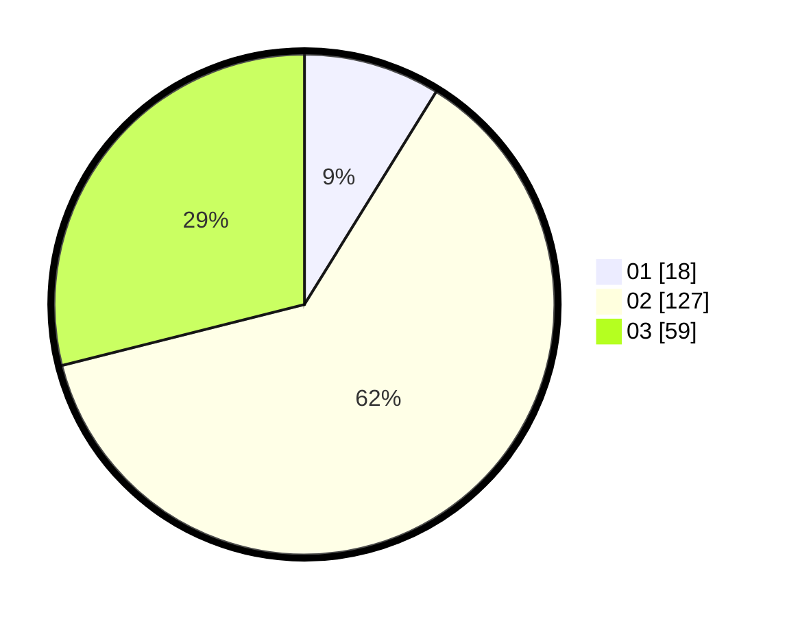

# Hasil

Hasil perolehan suara paslon dapat dilihat pada file paslon-01.txt, paslon-02.txt, dan paslon-03.txt.

Jika tidak ada, artinya data tersebut belum ada pada SIREKAP.

## Perolehan Suara

 * Paslon 01: **18**.
 * Paslon 02: **127**.
 * Paslon 03: **59**.

## Foto C Plano

https://sirekap-obj-formc.kpu.go.id/de31/pemilu/ppwp/31/73/01/10/05/3173011005024-20240215-005521--763ccd4f-b63d-4dfa-90fd-9b236011634d.jpg

https://sirekap-obj-formc.kpu.go.id/de31/pemilu/ppwp/31/73/01/10/05/3173011005024-20240215-005353--54ad8389-fe89-453c-b675-f368403e758b.jpg

https://sirekap-obj-formc.kpu.go.id/de31/pemilu/ppwp/31/73/01/10/05/3173011005024-20240215-005635--c6344645-7afa-4687-a5b6-46d9a9efc759.jpg
