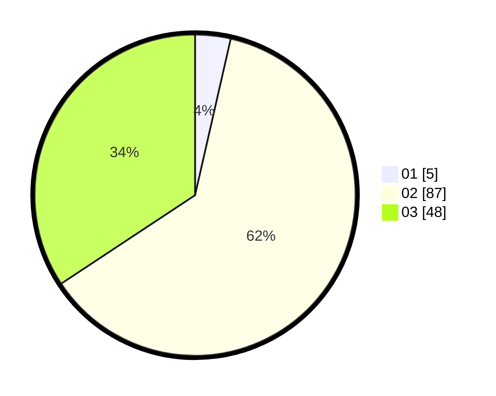

# Hasil

Hasil perolehan suara paslon dapat dilihat pada file paslon-01.txt, paslon-02.txt, dan paslon-03.txt.

Jika tidak ada, artinya data tersebut belum ada pada SIREKAP.

## Perolehan Suara

 * Paslon 01: **5**.
 * Paslon 02: **87**.
 * Paslon 03: **48**.

## Foto C Plano

https://sirekap-obj-formc.kpu.go.id/cd78/pemilu/ppwp/31/73/01/10/05/3173011005025-20240214-230231--9ee2b868-b0e3-404d-97fd-75bde218c6e7.jpg

https://sirekap-obj-formc.kpu.go.id/cd78/pemilu/ppwp/31/73/01/10/05/3173011005025-20240214-230317--7f269272-64d3-480c-8976-fa650a2c9f52.jpg

https://sirekap-obj-formc.kpu.go.id/cd78/pemilu/ppwp/31/73/01/10/05/3173011005025-20240214-230347--57c5a88f-4316-4f20-ab9e-0c4140770f1c.jpg
