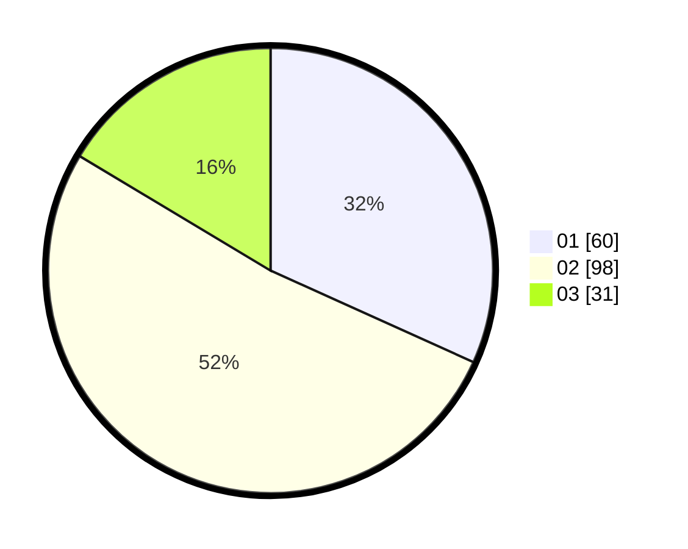

# Hasil

Hasil perolehan suara paslon dapat dilihat pada file paslon-01.txt, paslon-02.txt, dan paslon-03.txt.

Jika tidak ada, artinya data tersebut belum ada pada SIREKAP.

## Perolehan Suara

 * Paslon 01: **60**.
 * Paslon 02: **98**.
 * Paslon 03: **31**.

## Foto C Plano

https://sirekap-obj-formc.kpu.go.id/1ac6/pemilu/ppwp/31/73/01/10/05/3173011005030-20240214-220516--67581980-ee15-45d0-95f5-a57f7f31d317.jpg

https://sirekap-obj-formc.kpu.go.id/1ac6/pemilu/ppwp/31/73/01/10/05/3173011005030-20240214-214153--03dce129-5bf1-4a1c-b5a2-27de2b5a5be4.jpg

https://sirekap-obj-formc.kpu.go.id/1ac6/pemilu/ppwp/31/73/01/10/05/3173011005030-20240214-220652--679e3dad-d7f2-4372-bb89-d33b17b172fb.jpg
