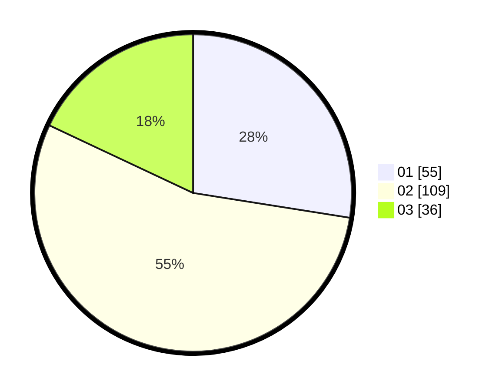

# Hasil

Hasil perolehan suara paslon dapat dilihat pada file paslon-01.txt, paslon-02.txt, dan paslon-03.txt.

Jika tidak ada, artinya data tersebut belum ada pada SIREKAP.

## Perolehan Suara

 * Paslon 01: **55**.
 * Paslon 02: **109**.
 * Paslon 03: **36**.

## Foto C Plano

https://sirekap-obj-formc.kpu.go.id/1b86/pemilu/ppwp/31/73/01/10/05/3173011005031-20240215-022452--3b444c47-97f9-4ecd-a89f-aa1777ac6334.jpg

https://sirekap-obj-formc.kpu.go.id/1b86/pemilu/ppwp/31/73/01/10/05/3173011005031-20240215-022520--e02f7242-a8ec-46f6-981d-42ffa4eecdfc.jpg

https://sirekap-obj-formc.kpu.go.id/1b86/pemilu/ppwp/31/73/01/10/05/3173011005031-20240215-022542--3001b66e-388e-4040-9c70-155bb56f674f.jpg

## DATA PEMILIH TETAP

Jumlah pemilih dalam DPT: **287**.
 * L: **149**.
 * P: **138**.

## DATA PENGGUNA HAK PILIH

Jumlah pengguna hak pilih dalam DPT: **199**.
 * L: **100**.
 * P: **99**.

Jumlah pengguna hak pilih dalam DPTb: **0**.
 * L: **0**.
 * P: **0**.

Jumlah pengguna hak pilih dalam DPK: **1**.
 * L: **1**.
 * P: **0**.

Jumlah pengguna hak pilih: **200**.
 * L: **101**.
 * P: **99**.

## JUMLAH SUARA SAH DAN TIDAK SAH

JUMLAH SELURUH SUARA SAH: **200**.

JUMLAH SUARA TIDAK SAH: **0**.

JUMLAH SELURUH SUARA SAH DAN SUARA TIDAK SAH: **200**.
