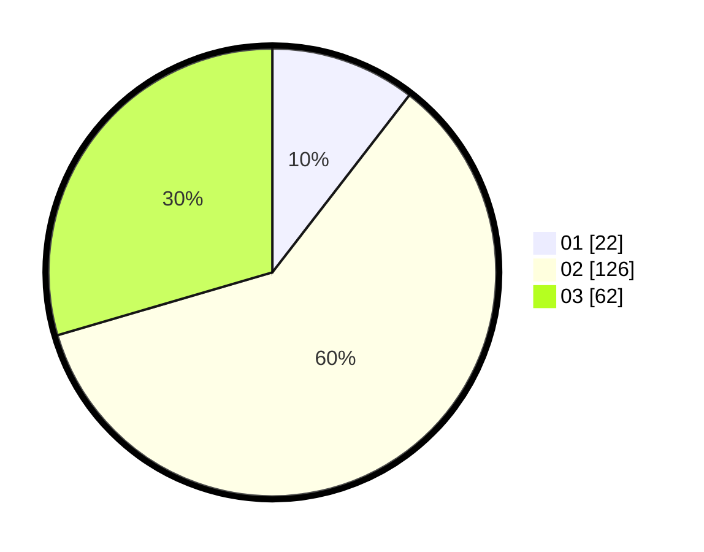

# Hasil

Hasil perolehan suara paslon dapat dilihat pada file paslon-01.txt, paslon-02.txt, dan paslon-03.txt.

Jika tidak ada, artinya data tersebut belum ada pada SIREKAP.

## Perolehan Suara

 * Paslon 01: **22**.
 * Paslon 02: **126**.
 * Paslon 03: **62**.

## Foto C Plano

https://sirekap-obj-formc.kpu.go.id/b8b9/pemilu/ppwp/31/73/01/10/05/3173011005032-20240214-200332--6a6ae14a-42ac-4911-9ffb-839463733bfa.jpg

https://sirekap-obj-formc.kpu.go.id/b8b9/pemilu/ppwp/31/73/01/10/05/3173011005032-20240214-200029--03b47ede-6a92-41da-beeb-0bad35aa01ec.jpg

https://sirekap-obj-formc.kpu.go.id/b8b9/pemilu/ppwp/31/73/01/10/05/3173011005032-20240214-200214--59530787-2060-45c8-8393-025a315786b5.jpg

## DATA PEMILIH TETAP

Jumlah pemilih dalam DPT: **283**.
 * L: **142**.
 * P: **141**.

## DATA PENGGUNA HAK PILIH

Jumlah pengguna hak pilih dalam DPT: **213**.
 * L: **100**.
 * P: **113**.

Jumlah pengguna hak pilih dalam DPTb: **0**.
 * L: **0**.
 * P: **0**.

Jumlah pengguna hak pilih dalam DPK: **2**.
 * L: **1**.
 * P: **1**.

Jumlah pengguna hak pilih: **215**.
 * L: **101**.
 * P: **114**.

## JUMLAH SUARA SAH DAN TIDAK SAH

JUMLAH SELURUH SUARA SAH: **210**.

JUMLAH SUARA TIDAK SAH: **5**.

JUMLAH SELURUH SUARA SAH DAN SUARA TIDAK SAH: **215**.
