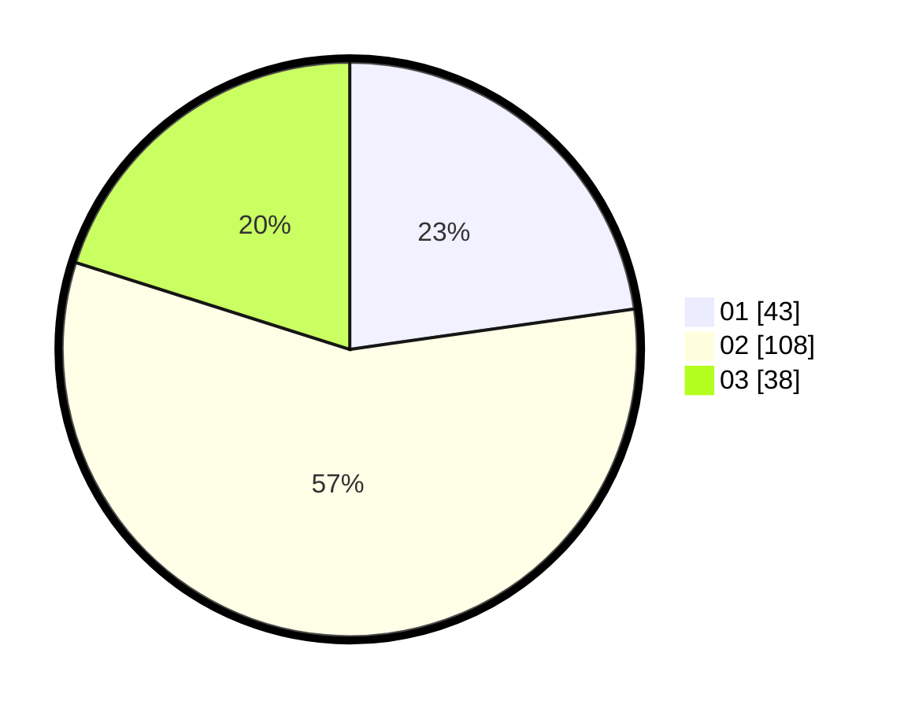

# Hasil

Hasil perolehan suara paslon dapat dilihat pada file paslon-01.txt, paslon-02.txt, dan paslon-03.txt.

Jika tidak ada, artinya data tersebut belum ada pada SIREKAP.

## Perolehan Suara

 * Paslon 01: **43**.
 * Paslon 02: **108**.
 * Paslon 03: **38**.

## Foto C Plano

https://sirekap-obj-formc.kpu.go.id/4d55/pemilu/ppwp/31/73/01/10/05/3173011005033-20240216-003252--e77dbb11-bcce-47cc-842b-58b52c0cc3e8.jpg

https://sirekap-obj-formc.kpu.go.id/4d55/pemilu/ppwp/31/73/01/10/05/3173011005033-20240216-003255--4f101b32-22bf-42fd-a5d2-a7ff30567db8.jpg

https://sirekap-obj-formc.kpu.go.id/4d55/pemilu/ppwp/31/73/01/10/05/3173011005033-20240216-003253--313eb351-6d69-4908-aa8f-cb620db05d70.jpg

## DATA PEMILIH TETAP

Jumlah pemilih dalam DPT: **281**.
 * L: **145**.
 * P: **136**.

## DATA PENGGUNA HAK PILIH

Jumlah pengguna hak pilih dalam DPT: **190**.
 * L: **95**.
 * P: **95**.

Jumlah pengguna hak pilih dalam DPTb: **0**.
 * L: **0**.
 * P: **0**.

Jumlah pengguna hak pilih dalam DPK: **4**.
 * L: **4**.
 * P: **0**.

Jumlah pengguna hak pilih: **194**.
 * L: **99**.
 * P: **95**.

## JUMLAH SUARA SAH DAN TIDAK SAH

JUMLAH SELURUH SUARA SAH: **189**.

JUMLAH SUARA TIDAK SAH: **5**.

JUMLAH SELURUH SUARA SAH DAN SUARA TIDAK SAH: **194**.
