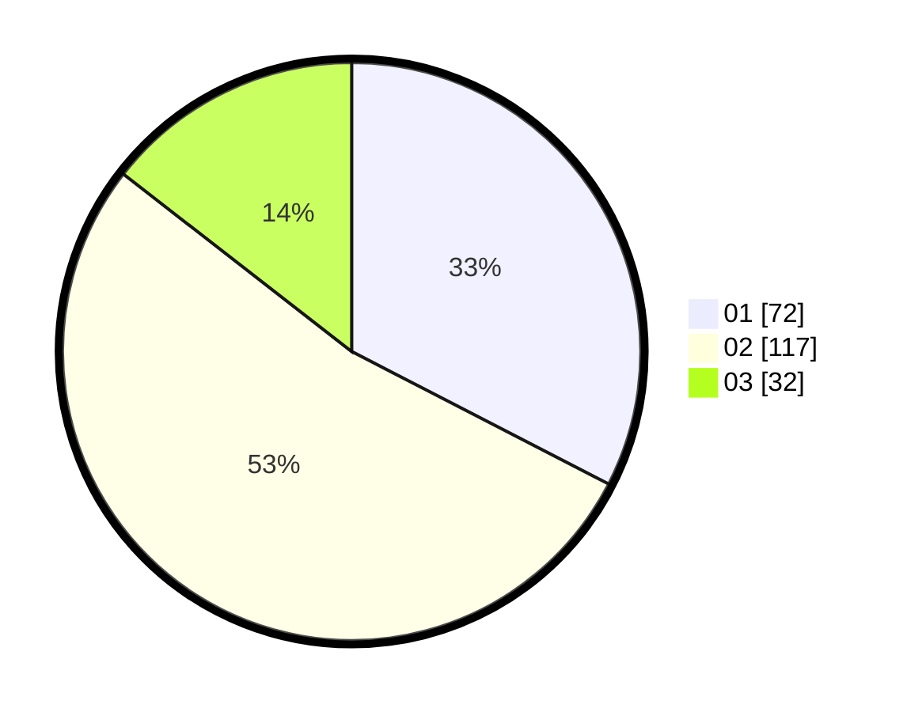

# Hasil

Hasil perolehan suara paslon dapat dilihat pada file paslon-01.txt, paslon-02.txt, dan paslon-03.txt.

Jika tidak ada, artinya data tersebut belum ada pada SIREKAP.

## Perolehan Suara

 * Paslon 01: **72**.
 * Paslon 02: **117**.
 * Paslon 03: **32**.

## Foto C Plano

https://sirekap-obj-formc.kpu.go.id/ab4b/pemilu/ppwp/31/73/01/10/05/3173011005034-20240216-034740--d965d21a-9852-4831-bfd3-a75852e7f646.jpg

https://sirekap-obj-formc.kpu.go.id/ab4b/pemilu/ppwp/31/73/01/10/05/3173011005034-20240216-034747--e876df3c-dc86-4197-8bc5-9f6c63a5cc72.jpg

https://sirekap-obj-formc.kpu.go.id/ab4b/pemilu/ppwp/31/73/01/10/05/3173011005034-20240216-034745--5d9a5a5a-877a-4da8-b876-fb55d589062f.jpg

## DATA PEMILIH TETAP

Jumlah pemilih dalam DPT: **287**.
 * L: **165**.
 * P: **122**.

## DATA PENGGUNA HAK PILIH

Jumlah pengguna hak pilih dalam DPT: **228**.
 * L: **122**.
 * P: **106**.

Jumlah pengguna hak pilih dalam DPTb: **1**.
 * L: **0**.
 * P: **1**.

Jumlah pengguna hak pilih dalam DPK: **0**.
 * L: **0**.
 * P: **0**.

Jumlah pengguna hak pilih: **229**.
 * L: **122**.
 * P: **107**.

## JUMLAH SUARA SAH DAN TIDAK SAH

JUMLAH SELURUH SUARA SAH: **221**.

JUMLAH SUARA TIDAK SAH: **8**.

JUMLAH SELURUH SUARA SAH DAN SUARA TIDAK SAH: **229**.
