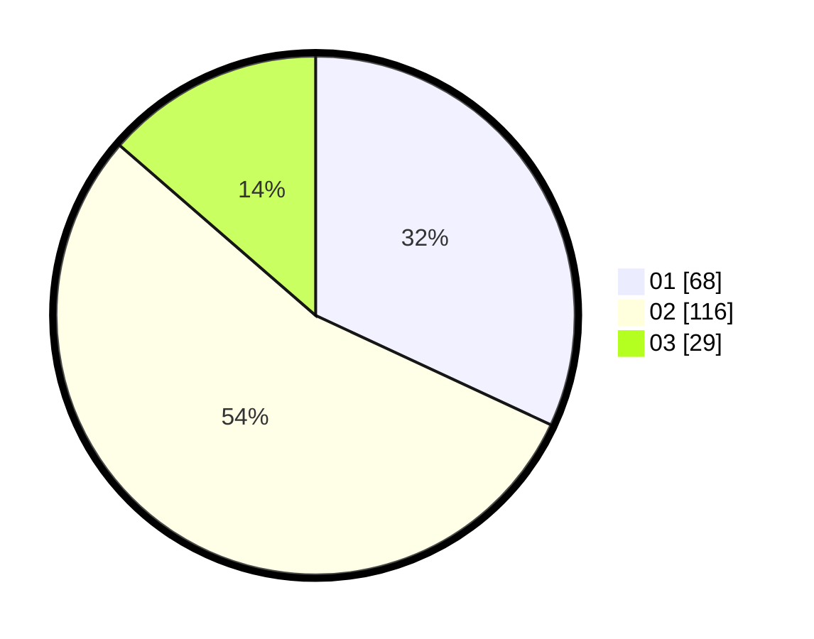

# Hasil

Hasil perolehan suara paslon dapat dilihat pada file paslon-01.txt, paslon-02.txt, dan paslon-03.txt.

Jika tidak ada, artinya data tersebut belum ada pada SIREKAP.

## Perolehan Suara

 * Paslon 01: **68**.
 * Paslon 02: **116**.
 * Paslon 03: **29**.

## Foto C Plano

https://sirekap-obj-formc.kpu.go.id/348a/pemilu/ppwp/31/73/01/10/05/3173011005037-20240214-192224--629b83fa-b771-483f-8f07-f91d00cef791.jpg

https://sirekap-obj-formc.kpu.go.id/348a/pemilu/ppwp/31/73/01/10/05/3173011005037-20240214-224428--781b2997-7a35-4260-a586-fbe359e5d597.jpg

https://sirekap-obj-formc.kpu.go.id/348a/pemilu/ppwp/31/73/01/10/05/3173011005037-20240214-162230--ade1e80c-9a04-411a-8ef8-595c34915fda.jpg

## DATA PEMILIH TETAP

Jumlah pemilih dalam DPT: **283**.
 * L: **150**.
 * P: **133**.

## DATA PENGGUNA HAK PILIH

Jumlah pengguna hak pilih dalam DPT: **214**.
 * L: **107**.
 * P: **107**.

Jumlah pengguna hak pilih dalam DPTb: **0**.
 * L: **0**.
 * P: **0**.

Jumlah pengguna hak pilih dalam DPK: **0**.
 * L: **0**.
 * P: **0**.

Jumlah pengguna hak pilih: **214**.
 * L: **107**.
 * P: **107**.

## JUMLAH SUARA SAH DAN TIDAK SAH

JUMLAH SELURUH SUARA SAH: **213**.

JUMLAH SUARA TIDAK SAH: **1**.

JUMLAH SELURUH SUARA SAH DAN SUARA TIDAK SAH: **214**.
