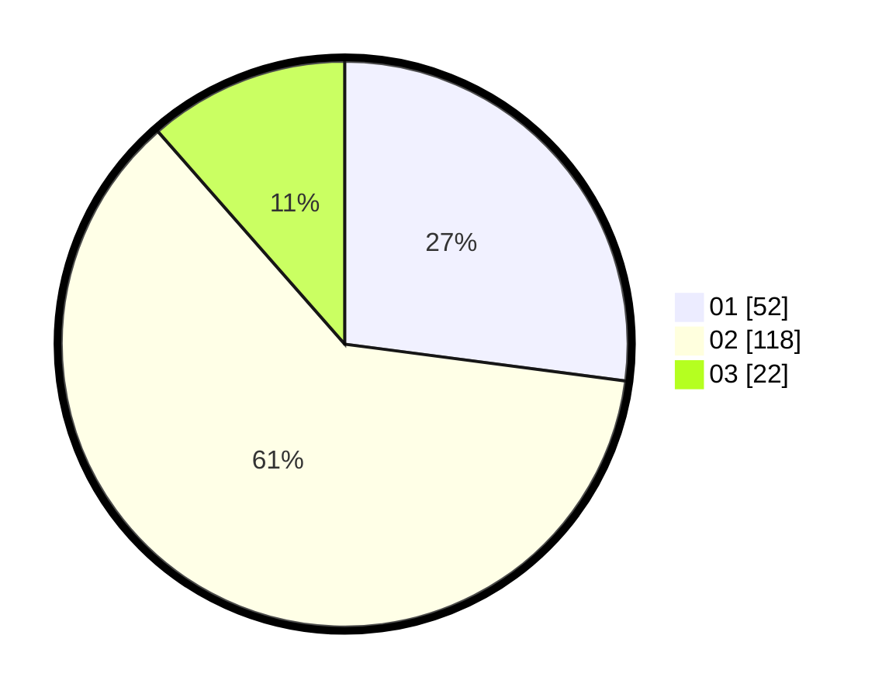

# Hasil

Hasil perolehan suara paslon dapat dilihat pada file paslon-01.txt, paslon-02.txt, dan paslon-03.txt.

Jika tidak ada, artinya data tersebut belum ada pada SIREKAP.

## Perolehan Suara

 * Paslon 01: **52**.
 * Paslon 02: **118**.
 * Paslon 03: **22**.

## Foto C Plano

https://sirekap-obj-formc.kpu.go.id/5354/pemilu/ppwp/31/73/01/10/05/3173011005038-20240214-160102--1c33bcca-e189-407c-932c-9a45c74b3ad0.jpg

https://sirekap-obj-formc.kpu.go.id/5354/pemilu/ppwp/31/73/01/10/05/3173011005038-20240214-160101--e10bb180-b1c8-4c42-806b-df1145c98a3b.jpg

https://sirekap-obj-formc.kpu.go.id/5354/pemilu/ppwp/31/73/01/10/05/3173011005038-20240214-175312--ba9716c2-09f8-43cf-a1e1-140b5866b682.jpg

## DATA PEMILIH TETAP

Jumlah pemilih dalam DPT: **276**.
 * L: **134**.
 * P: **142**.

## DATA PENGGUNA HAK PILIH

Jumlah pengguna hak pilih dalam DPT: **195**.
 * L: **95**.
 * P: **100**.

Jumlah pengguna hak pilih dalam DPTb: **0**.
 * L: **0**.
 * P: **0**.

Jumlah pengguna hak pilih dalam DPK: **1**.
 * L: **1**.
 * P: **0**.

Jumlah pengguna hak pilih: **196**.
 * L: **96**.
 * P: **100**.

## JUMLAH SUARA SAH DAN TIDAK SAH

JUMLAH SELURUH SUARA SAH: **192**.

JUMLAH SUARA TIDAK SAH: **4**.

JUMLAH SELURUH SUARA SAH DAN SUARA TIDAK SAH: **196**.
