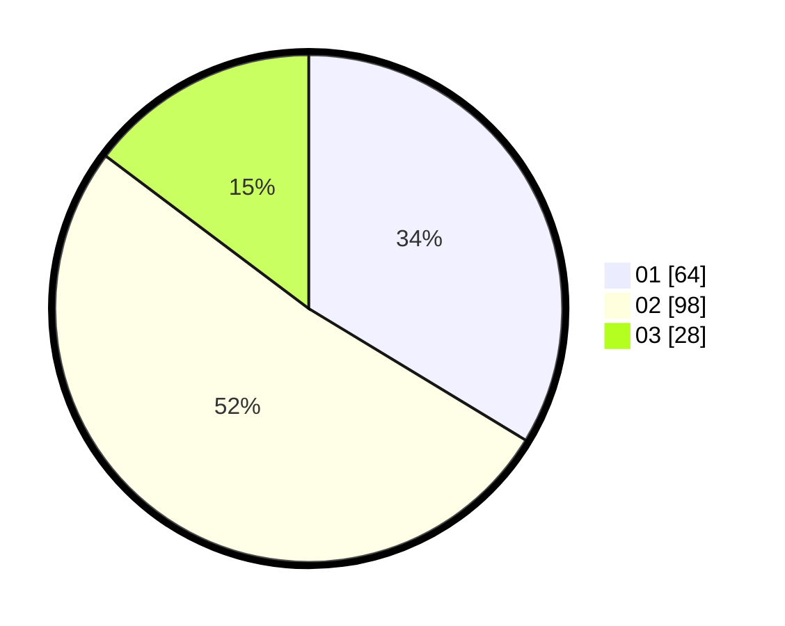

# Hasil

Hasil perolehan suara paslon dapat dilihat pada file paslon-01.txt, paslon-02.txt, dan paslon-03.txt.

Jika tidak ada, artinya data tersebut belum ada pada SIREKAP.

## Perolehan Suara

 * Paslon 01: **64**.
 * Paslon 02: **98**.
 * Paslon 03: **28**.

## Foto C Plano

https://sirekap-obj-formc.kpu.go.id/7953/pemilu/ppwp/31/73/01/10/05/3173011005042-20240214-194729--06101f81-9092-4ddd-977a-00ffecd2c5d4.jpg

https://sirekap-obj-formc.kpu.go.id/7953/pemilu/ppwp/31/73/01/10/05/3173011005042-20240214-212407--5393f1c4-db3c-4e94-b353-5576d66b1a4d.jpg

https://sirekap-obj-formc.kpu.go.id/7953/pemilu/ppwp/31/73/01/10/05/3173011005042-20240214-212314--a8985a7c-5dfb-4baa-85ce-7e755999d085.jpg

## DATA PEMILIH TETAP

Jumlah pemilih dalam DPT: **299**.
 * L: **148**.
 * P: **151**.

## DATA PENGGUNA HAK PILIH

Jumlah pengguna hak pilih dalam DPT: **188**.
 * L: **93**.
 * P: **95**.

Jumlah pengguna hak pilih dalam DPTb: **0**.
 * L: **0**.
 * P: **0**.

Jumlah pengguna hak pilih dalam DPK: **4**.
 * L: **1**.
 * P: **3**.

Jumlah pengguna hak pilih: **192**.
 * L: **94**.
 * P: **98**.

## JUMLAH SUARA SAH DAN TIDAK SAH

JUMLAH SELURUH SUARA SAH: **190**.

JUMLAH SUARA TIDAK SAH: **2**.

JUMLAH SELURUH SUARA SAH DAN SUARA TIDAK SAH: **192**.
