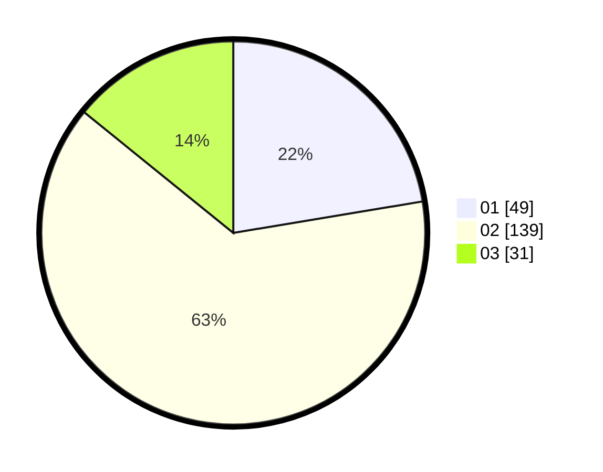

# Hasil

Hasil perolehan suara paslon dapat dilihat pada file paslon-01.txt, paslon-02.txt, dan paslon-03.txt.

Jika tidak ada, artinya data tersebut belum ada pada SIREKAP.

## Perolehan Suara

 * Paslon 01: **49**.
 * Paslon 02: **139**.
 * Paslon 03: **31**.

## Foto C Plano

https://sirekap-obj-formc.kpu.go.id/30c2/pemilu/ppwp/31/73/01/10/05/3173011005050-20240216-053321--7a66b5b6-e005-42c7-9317-3daf49295f21.jpg

https://sirekap-obj-formc.kpu.go.id/30c2/pemilu/ppwp/31/73/01/10/05/3173011005050-20240216-053332--91c7dc96-dfac-40c6-9e51-acac994fa73b.jpg

https://sirekap-obj-formc.kpu.go.id/30c2/pemilu/ppwp/31/73/01/10/05/3173011005050-20240216-053329--b6436132-d543-4c71-9fcf-426eff4394ab.jpg

## DATA PEMILIH TETAP

Jumlah pemilih dalam DPT: **283**.
 * L: **140**.
 * P: **143**.

## DATA PENGGUNA HAK PILIH

Jumlah pengguna hak pilih dalam DPT: **217**.
 * L: **103**.
 * P: **114**.

Jumlah pengguna hak pilih dalam DPTb: **0**.
 * L: **0**.
 * P: **0**.

Jumlah pengguna hak pilih dalam DPK: **0**.
 * L: **0**.
 * P: **0**.

Jumlah pengguna hak pilih: **217**.
 * L: **103**.
 * P: **114**.

## JUMLAH SUARA SAH DAN TIDAK SAH

JUMLAH SELURUH SUARA SAH: **211**.

JUMLAH SUARA TIDAK SAH: **6**.

JUMLAH SELURUH SUARA SAH DAN SUARA TIDAK SAH: **217**.
