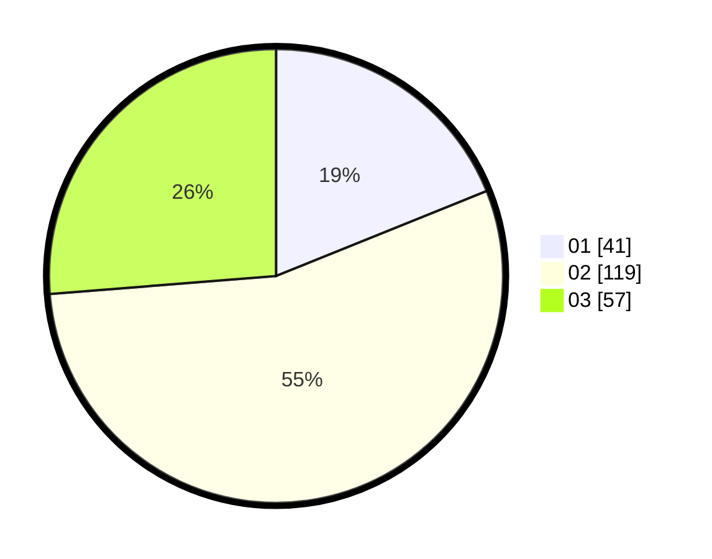

# Hasil

Hasil perolehan suara paslon dapat dilihat pada file paslon-01.txt, paslon-02.txt, dan paslon-03.txt.

Jika tidak ada, artinya data tersebut belum ada pada SIREKAP.

## Perolehan Suara

 * Paslon 01: **41**.
 * Paslon 02: **119**.
 * Paslon 03: **57**.

## Foto C Plano

https://sirekap-obj-formc.kpu.go.id/7890/pemilu/ppwp/31/73/01/10/05/3173011005051-20240214-204439--c56d2902-7133-4ce0-a62a-ad140ecdadc2.jpg

https://sirekap-obj-formc.kpu.go.id/7890/pemilu/ppwp/31/73/01/10/05/3173011005051-20240214-204612--25e403b3-0be9-4f5b-a2e4-d98014f0a655.jpg

https://sirekap-obj-formc.kpu.go.id/7890/pemilu/ppwp/31/73/01/10/05/3173011005051-20240214-204656--aa3a4d33-a868-4efe-8414-98b19a95636d.jpg

## DATA PEMILIH TETAP

Jumlah pemilih dalam DPT: **281**.
 * L: **136**.
 * P: **145**.

## DATA PENGGUNA HAK PILIH

Jumlah pengguna hak pilih dalam DPT: **220**.
 * L: **103**.
 * P: **117**.

Jumlah pengguna hak pilih dalam DPTb: **0**.
 * L: **0**.
 * P: **0**.

Jumlah pengguna hak pilih dalam DPK: **0**.
 * L: **0**.
 * P: **0**.

Jumlah pengguna hak pilih: **220**.
 * L: **103**.
 * P: **117**.

## JUMLAH SUARA SAH DAN TIDAK SAH

JUMLAH SELURUH SUARA SAH: **217**.

JUMLAH SUARA TIDAK SAH: **3**.

JUMLAH SELURUH SUARA SAH DAN SUARA TIDAK SAH: **220**.
