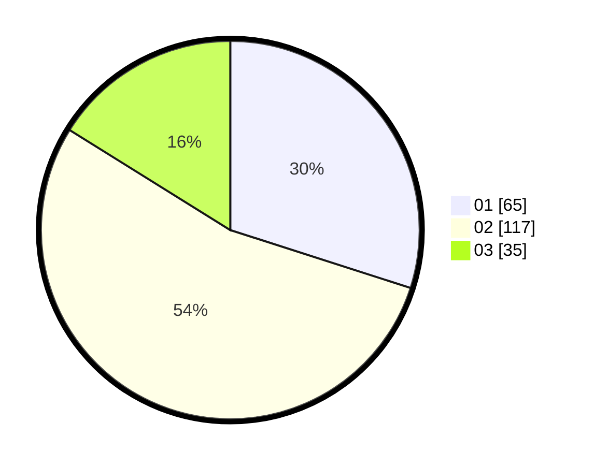

# Hasil

Hasil perolehan suara paslon dapat dilihat pada file paslon-01.txt, paslon-02.txt, dan paslon-03.txt.

Jika tidak ada, artinya data tersebut belum ada pada SIREKAP.

## Perolehan Suara

 * Paslon 01: **65**.
 * Paslon 02: **117**.
 * Paslon 03: **35**.

## Foto C Plano

https://sirekap-obj-formc.kpu.go.id/2e91/pemilu/ppwp/31/73/01/10/05/3173011005053-20240214-232603--40bc3fd0-158e-4b3d-8d07-bdda74553c0f.jpg

https://sirekap-obj-formc.kpu.go.id/2e91/pemilu/ppwp/31/73/01/10/05/3173011005053-20240214-232735--cadc85fc-6be6-4169-a0fb-febedd4c212c.jpg

https://sirekap-obj-formc.kpu.go.id/2e91/pemilu/ppwp/31/73/01/10/05/3173011005053-20240214-232910--cd649be1-5460-470e-bd24-d956e7650178.jpg
