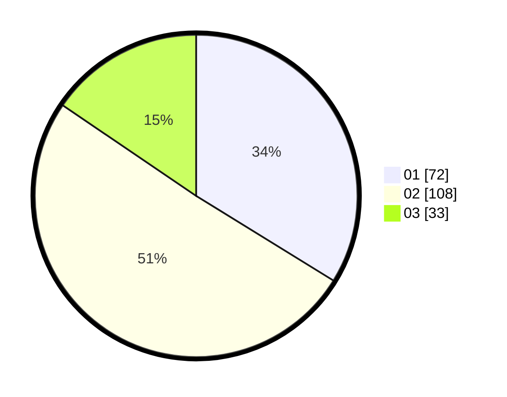

# Hasil

Hasil perolehan suara paslon dapat dilihat pada file paslon-01.txt, paslon-02.txt, dan paslon-03.txt.

Jika tidak ada, artinya data tersebut belum ada pada SIREKAP.

## Perolehan Suara

 * Paslon 01: **72**.
 * Paslon 02: **108**.
 * Paslon 03: **33**.

## Foto C Plano

https://sirekap-obj-formc.kpu.go.id/1897/pemilu/ppwp/31/73/01/10/05/3173011005057-20240214-212357--2ba88c0d-7050-422a-a2a9-ce8cacc31b6f.jpg

https://sirekap-obj-formc.kpu.go.id/1897/pemilu/ppwp/31/73/01/10/05/3173011005057-20240214-212558--f178d0dc-9856-4bf9-ac3d-eea9bc7b7229.jpg

https://sirekap-obj-formc.kpu.go.id/1897/pemilu/ppwp/31/73/01/10/05/3173011005057-20240214-212747--23acc18f-9b00-4890-9a1d-715758bf331a.jpg
