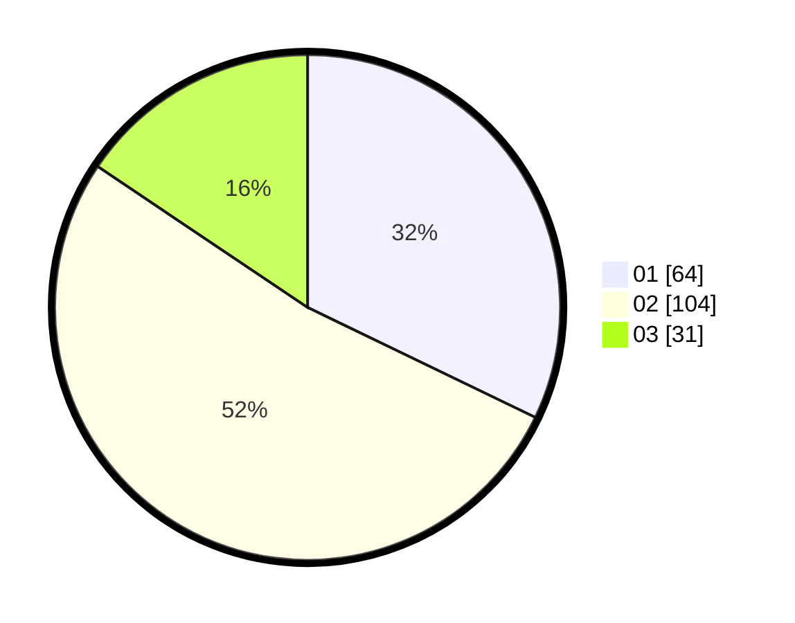

# Hasil

Hasil perolehan suara paslon dapat dilihat pada file paslon-01.txt, paslon-02.txt, dan paslon-03.txt.

Jika tidak ada, artinya data tersebut belum ada pada SIREKAP.

## Perolehan Suara

 * Paslon 01: **64**.
 * Paslon 02: **104**.
 * Paslon 03: **31**.

## Foto C Plano

https://sirekap-obj-formc.kpu.go.id/e2f0/pemilu/ppwp/31/73/01/10/05/3173011005058-20240214-213759--362e826b-245d-4e1c-bba5-aa884cf1d5fa.jpg

https://sirekap-obj-formc.kpu.go.id/e2f0/pemilu/ppwp/31/73/01/10/05/3173011005058-20240214-213928--c072b814-ee75-44bd-8b35-e747d662dc01.jpg

https://sirekap-obj-formc.kpu.go.id/e2f0/pemilu/ppwp/31/73/01/10/05/3173011005058-20240214-214023--8f398bf8-1e17-4988-b504-e6ef44337b9f.jpg

## DATA PEMILIH TETAP

Jumlah pemilih dalam DPT: **281**.
 * L: **144**.
 * P: **137**.

## DATA PENGGUNA HAK PILIH

Jumlah pengguna hak pilih dalam DPT: **202**.
 * L: **104**.
 * P: **98**.

Jumlah pengguna hak pilih dalam DPTb: **0**.
 * L: **0**.
 * P: **0**.

Jumlah pengguna hak pilih dalam DPK: **0**.
 * L: **0**.
 * P: **0**.

Jumlah pengguna hak pilih: **202**.
 * L: **104**.
 * P: **98**.

## JUMLAH SUARA SAH DAN TIDAK SAH

JUMLAH SELURUH SUARA SAH: **199**.

JUMLAH SUARA TIDAK SAH: **3**.

JUMLAH SELURUH SUARA SAH DAN SUARA TIDAK SAH: **202**.
