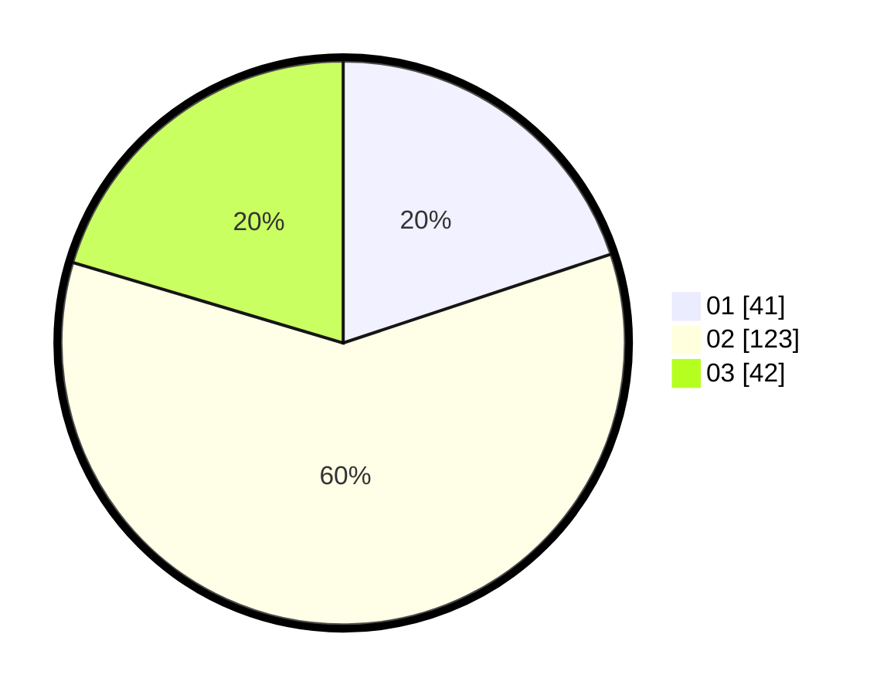

# Hasil

Hasil perolehan suara paslon dapat dilihat pada file paslon-01.txt, paslon-02.txt, dan paslon-03.txt.

Jika tidak ada, artinya data tersebut belum ada pada SIREKAP.

## Perolehan Suara

 * Paslon 01: **41**.
 * Paslon 02: **123**.
 * Paslon 03: **42**.

## Foto C Plano

https://sirekap-obj-formc.kpu.go.id/f4c7/pemilu/ppwp/31/73/01/10/05/3173011005060-20240214-193707--00bf4356-39e0-4dc7-9777-e82be60cd7dd.jpg

https://sirekap-obj-formc.kpu.go.id/f4c7/pemilu/ppwp/31/73/01/10/05/3173011005060-20240214-213249--aa56b874-d622-4aed-90b5-6119e8fa8941.jpg

https://sirekap-obj-formc.kpu.go.id/f4c7/pemilu/ppwp/31/73/01/10/05/3173011005060-20240214-193832--b5a628d6-50f2-4511-8967-7191f851806c.jpg

## DATA PEMILIH TETAP

Jumlah pemilih dalam DPT: **283**.
 * L: **139**.
 * P: **144**.

## DATA PENGGUNA HAK PILIH

Jumlah pengguna hak pilih dalam DPT: **205**.
 * L: **91**.
 * P: **114**.

Jumlah pengguna hak pilih dalam DPTb: **2**.
 * L: **1**.
 * P: **1**.

Jumlah pengguna hak pilih dalam DPK: **0**.
 * L: **0**.
 * P: **0**.

Jumlah pengguna hak pilih: **207**.
 * L: **92**.
 * P: **115**.

## JUMLAH SUARA SAH DAN TIDAK SAH

JUMLAH SELURUH SUARA SAH: **206**.

JUMLAH SUARA TIDAK SAH: **2**.

JUMLAH SELURUH SUARA SAH DAN SUARA TIDAK SAH: **208**.
