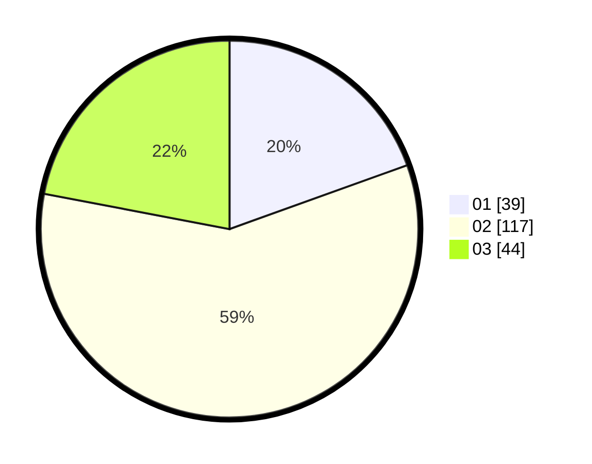

# Hasil

Hasil perolehan suara paslon dapat dilihat pada file paslon-01.txt, paslon-02.txt, dan paslon-03.txt.

Jika tidak ada, artinya data tersebut belum ada pada SIREKAP.

## Perolehan Suara

 * Paslon 01: **39**.
 * Paslon 02: **117**.
 * Paslon 03: **44**.

## Foto C Plano

https://sirekap-obj-formc.kpu.go.id/579d/pemilu/ppwp/31/73/01/10/05/3173011005061-20240214-225540--f8aa8ddf-a860-46a1-b396-d4f5c75695bf.jpg

https://sirekap-obj-formc.kpu.go.id/579d/pemilu/ppwp/31/73/01/10/05/3173011005061-20240214-225107--1eebadb2-06a9-43c9-a6f5-025b0840db11.jpg

https://sirekap-obj-formc.kpu.go.id/579d/pemilu/ppwp/31/73/01/10/05/3173011005061-20240214-224948--02104fe9-4c7a-4f16-a9f3-446ca4c7caec.jpg
