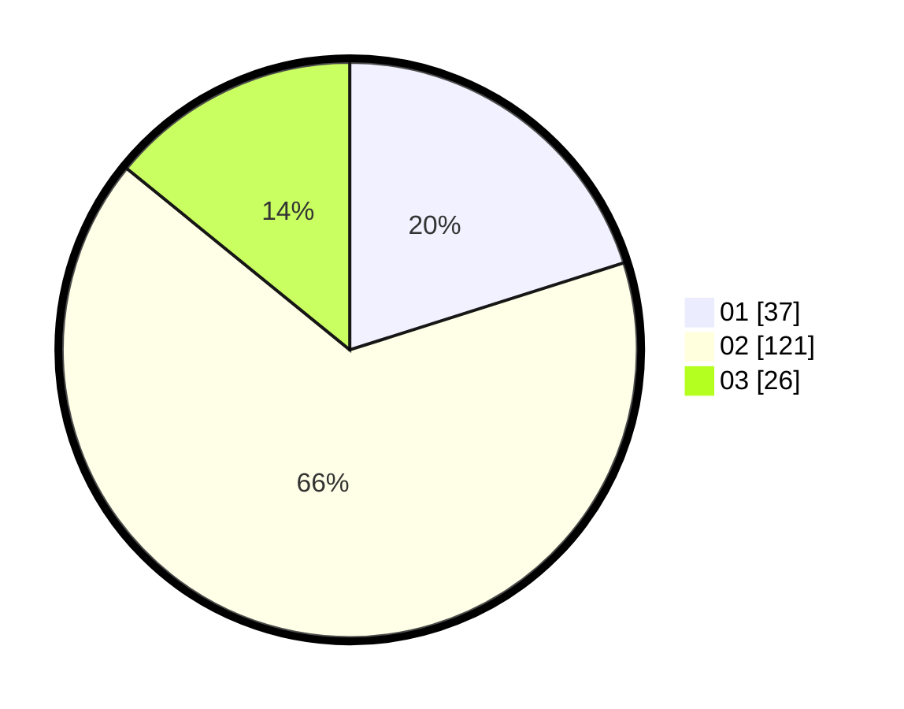

# Hasil

Hasil perolehan suara paslon dapat dilihat pada file paslon-01.txt, paslon-02.txt, dan paslon-03.txt.

Jika tidak ada, artinya data tersebut belum ada pada SIREKAP.

## Perolehan Suara

 * Paslon 01: **37**.
 * Paslon 02: **121**.
 * Paslon 03: **26**.

## Foto C Plano

https://sirekap-obj-formc.kpu.go.id/698c/pemilu/ppwp/31/73/01/10/05/3173011005062-20240215-002345--0f7621c0-9eb4-449a-956c-647f8ef4cbea.jpg

https://sirekap-obj-formc.kpu.go.id/698c/pemilu/ppwp/31/73/01/10/05/3173011005062-20240215-002438--dc75d404-1e0c-414e-9f44-8eb5d65b46b4.jpg

https://sirekap-obj-formc.kpu.go.id/698c/pemilu/ppwp/31/73/01/10/05/3173011005062-20240215-002549--04e5f366-7af1-4b21-8473-d7fb539465a8.jpg
