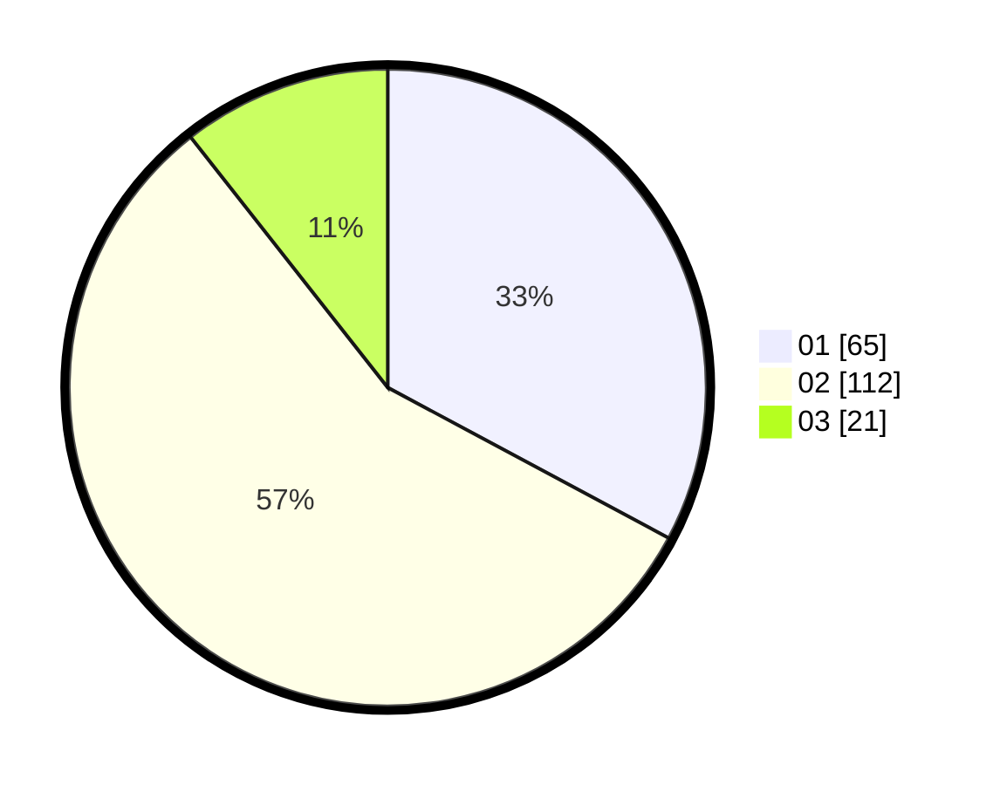

# Hasil

Hasil perolehan suara paslon dapat dilihat pada file paslon-01.txt, paslon-02.txt, dan paslon-03.txt.

Jika tidak ada, artinya data tersebut belum ada pada SIREKAP.

## Perolehan Suara

 * Paslon 01: **65**.
 * Paslon 02: **112**.
 * Paslon 03: **21**.

## Foto C Plano

https://sirekap-obj-formc.kpu.go.id/03ef/pemilu/ppwp/31/73/01/10/05/3173011005066-20240215-002744--84ca4e28-037c-45d3-b3de-d3f793ba8ed6.jpg

https://sirekap-obj-formc.kpu.go.id/03ef/pemilu/ppwp/31/73/01/10/05/3173011005066-20240215-003014--a8ee9272-e254-4108-bc82-778f6565a028.jpg

https://sirekap-obj-formc.kpu.go.id/03ef/pemilu/ppwp/31/73/01/10/05/3173011005066-20240215-003206--82a395c1-d3a5-490e-b093-8ad62f5f4038.jpg
