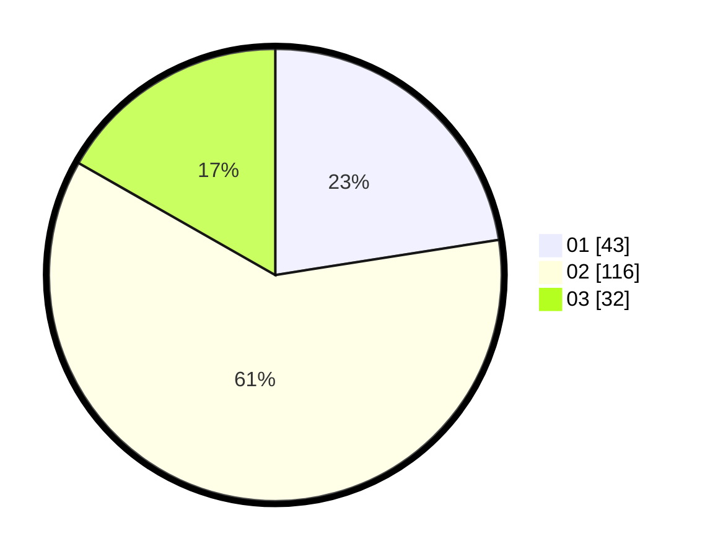

# Hasil

Hasil perolehan suara paslon dapat dilihat pada file paslon-01.txt, paslon-02.txt, dan paslon-03.txt.

Jika tidak ada, artinya data tersebut belum ada pada SIREKAP.

## Perolehan Suara

 * Paslon 01: **43**.
 * Paslon 02: **116**.
 * Paslon 03: **32**.

## Foto C Plano

https://sirekap-obj-formc.kpu.go.id/9a39/pemilu/ppwp/31/73/01/10/05/3173011005074-20240216-065905--20e365ba-e47d-45aa-a63e-b98fa9a4e4ed.jpg

https://sirekap-obj-formc.kpu.go.id/9a39/pemilu/ppwp/31/73/01/10/05/3173011005074-20240216-065907--3d92cda0-8b3b-415b-b60f-fc042fe62bfb.jpg

https://sirekap-obj-formc.kpu.go.id/9a39/pemilu/ppwp/31/73/01/10/05/3173011005074-20240216-065906--05ceb553-17ac-44b1-a634-e21234679969.jpg

## DATA PEMILIH TETAP

Jumlah pemilih dalam DPT: **281**.
 * L: **153**.
 * P: **128**.

## DATA PENGGUNA HAK PILIH

Jumlah pengguna hak pilih dalam DPT: **192**.
 * L: **103**.
 * P: **89**.

Jumlah pengguna hak pilih dalam DPTb: **0**.
 * L: **0**.
 * P: **0**.

Jumlah pengguna hak pilih dalam DPK: **0**.
 * L: **0**.
 * P: **0**.

Jumlah pengguna hak pilih: **192**.
 * L: **103**.
 * P: **89**.

## JUMLAH SUARA SAH DAN TIDAK SAH

JUMLAH SELURUH SUARA SAH: **191**.

JUMLAH SUARA TIDAK SAH: **1**.

JUMLAH SELURUH SUARA SAH DAN SUARA TIDAK SAH: **192**.
