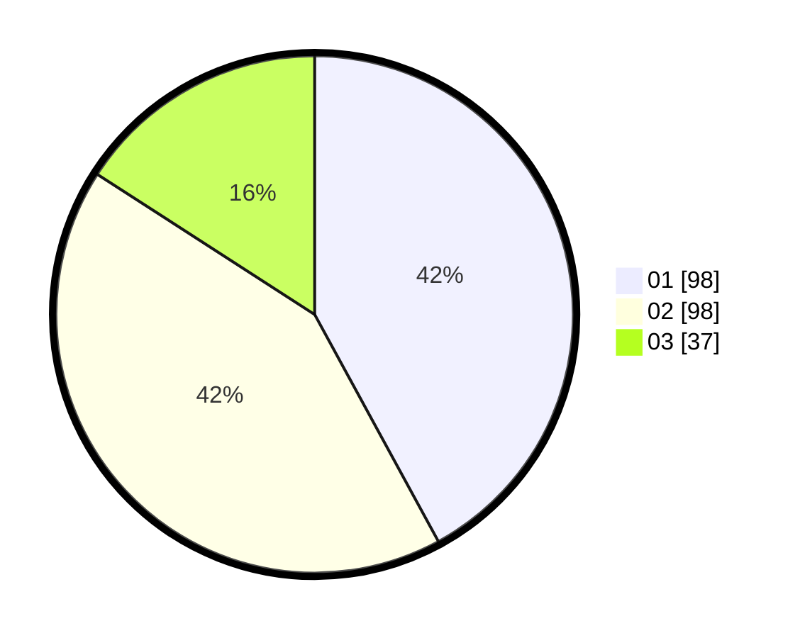

# Hasil

Hasil perolehan suara paslon dapat dilihat pada file paslon-01.txt, paslon-02.txt, dan paslon-03.txt.

Jika tidak ada, artinya data tersebut belum ada pada SIREKAP.

## Perolehan Suara

 * Paslon 01: **98**.
 * Paslon 02: **98**.
 * Paslon 03: **37**.

## Foto C Plano

https://sirekap-obj-formc.kpu.go.id/22be/pemilu/ppwp/31/73/01/10/05/3173011005077-20240215-031940--5b5e39ce-08fc-4969-b107-bcafd47f6de0.jpg

https://sirekap-obj-formc.kpu.go.id/22be/pemilu/ppwp/31/73/01/10/05/3173011005077-20240215-032030--5976da8e-c797-496e-a538-926a43fc1016.jpg

https://sirekap-obj-formc.kpu.go.id/22be/pemilu/ppwp/31/73/01/10/05/3173011005077-20240215-032231--c6ac6dd9-3bf6-47cb-9976-adb416af520e.jpg
