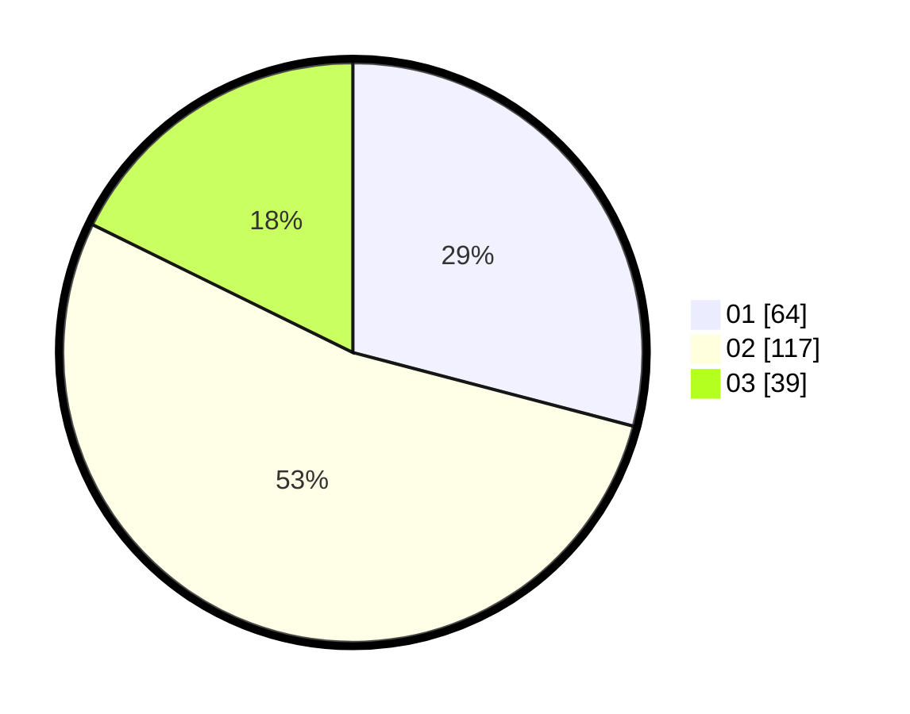

# Hasil

Hasil perolehan suara paslon dapat dilihat pada file paslon-01.txt, paslon-02.txt, dan paslon-03.txt.

Jika tidak ada, artinya data tersebut belum ada pada SIREKAP.

## Perolehan Suara

 * Paslon 01: **64**.
 * Paslon 02: **117**.
 * Paslon 03: **39**.

## Foto C Plano

https://sirekap-obj-formc.kpu.go.id/4fb6/pemilu/ppwp/31/73/01/10/05/3173011005078-20240215-165703--8aed395f-4f5b-4477-9094-0eef1608f1e0.jpg

https://sirekap-obj-formc.kpu.go.id/4fb6/pemilu/ppwp/31/73/01/10/05/3173011005078-20240215-165710--610ff5b4-9a55-4ac4-9d41-dc2142f19400.jpg

https://sirekap-obj-formc.kpu.go.id/4fb6/pemilu/ppwp/31/73/01/10/05/3173011005078-20240215-165712--f44473a4-f845-48ed-b2a8-905938fb5111.jpg
