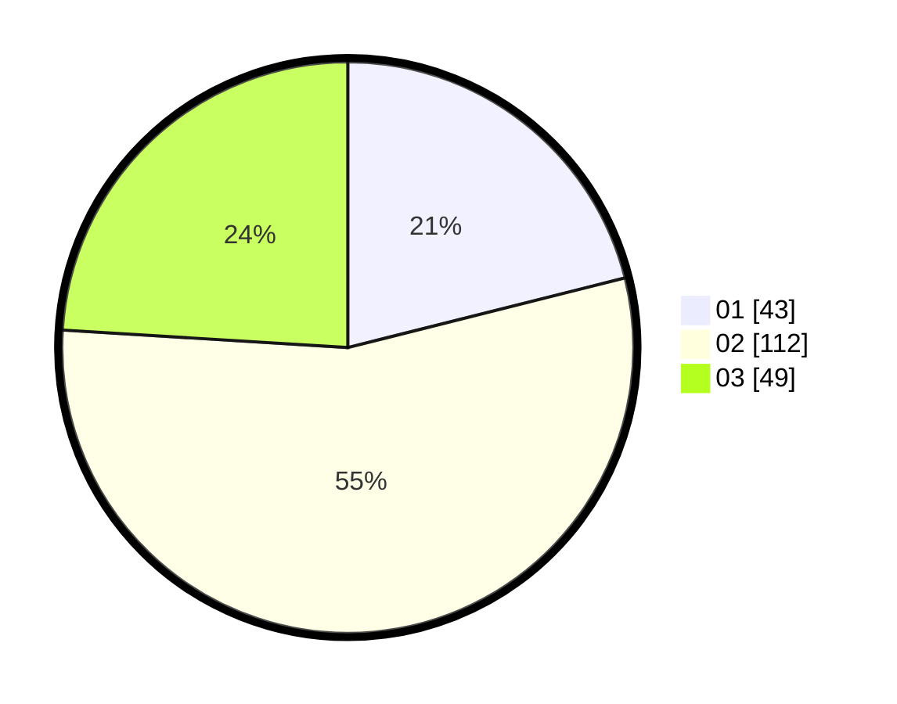

# Hasil

Hasil perolehan suara paslon dapat dilihat pada file paslon-01.txt, paslon-02.txt, dan paslon-03.txt.

Jika tidak ada, artinya data tersebut belum ada pada SIREKAP.

## Perolehan Suara

 * Paslon 01: **43**.
 * Paslon 02: **112**.
 * Paslon 03: **49**.

## Foto C Plano

https://sirekap-obj-formc.kpu.go.id/47a7/pemilu/ppwp/31/73/01/10/05/3173011005082-20240214-190908--bfd6538a-0a09-4144-8794-74db5b546057.jpg

https://sirekap-obj-formc.kpu.go.id/47a7/pemilu/ppwp/31/73/01/10/05/3173011005082-20240214-185504--b592d6c1-3ca8-486f-ab27-30079da4004a.jpg

https://sirekap-obj-formc.kpu.go.id/47a7/pemilu/ppwp/31/73/01/10/05/3173011005082-20240215-004305--b71c10c6-a87b-4a91-90ba-8dde88e1aede.jpg
