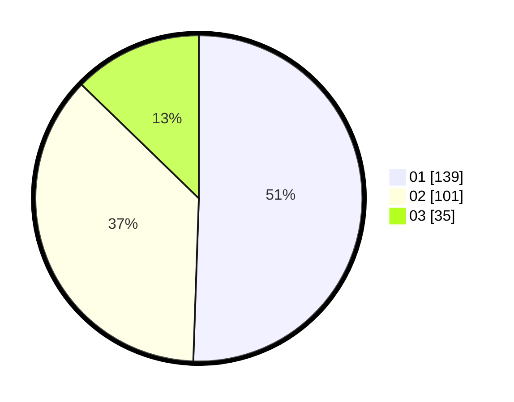

# Hasil

Hasil perolehan suara paslon dapat dilihat pada file paslon-01.txt, paslon-02.txt, dan paslon-03.txt.

Jika tidak ada, artinya data tersebut belum ada pada SIREKAP.

## Perolehan Suara

 * Paslon 01: **139**.
 * Paslon 02: **101**.
 * Paslon 03: **35**.

## Foto C Plano

https://sirekap-obj-formc.kpu.go.id/6099/pemilu/ppwp/31/73/01/10/05/3173011005084-20240214-215749--9fce069f-635d-4de0-a988-a56a7c680f7a.jpg

https://sirekap-obj-formc.kpu.go.id/6099/pemilu/ppwp/31/73/01/10/05/3173011005084-20240214-210248--46daf9ce-218f-4b09-b7d4-106d0b14ba9f.jpg

https://sirekap-obj-formc.kpu.go.id/6099/pemilu/ppwp/31/73/01/10/05/3173011005084-20240214-220534--a33e90ab-0063-4395-992a-82ace217bce4.jpg
