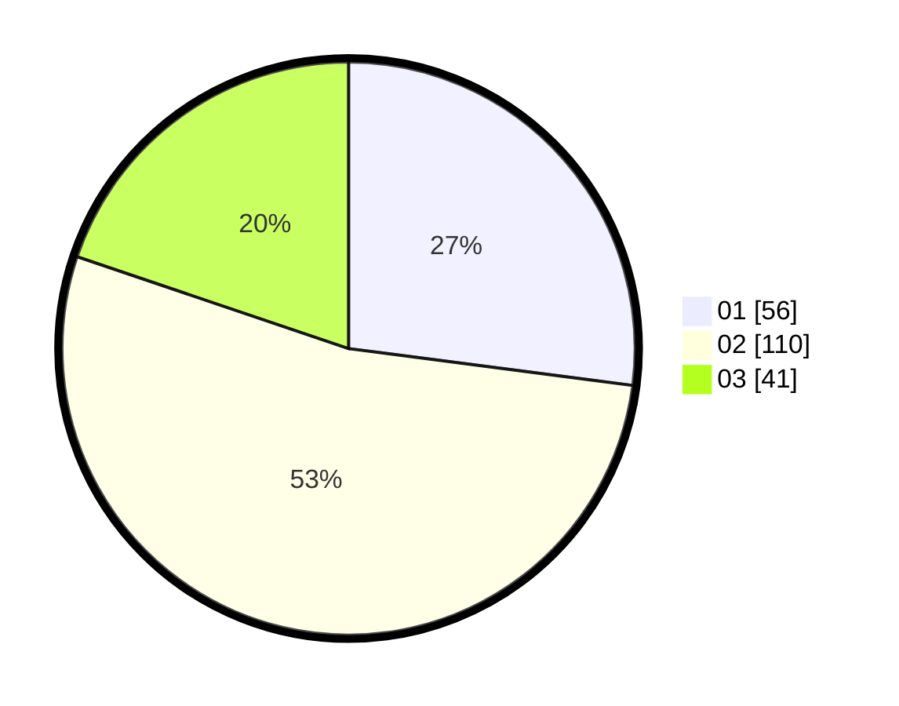

# Hasil

Hasil perolehan suara paslon dapat dilihat pada file paslon-01.txt, paslon-02.txt, dan paslon-03.txt.

Jika tidak ada, artinya data tersebut belum ada pada SIREKAP.

## Perolehan Suara

 * Paslon 01: **56**.
 * Paslon 02: **110**.
 * Paslon 03: **41**.

## Foto C Plano

https://sirekap-obj-formc.kpu.go.id/1915/pemilu/ppwp/31/73/01/10/05/3173011005090-20240215-001105--eaa1b4ef-9f1a-47f6-a026-05a2ff720b8c.jpg

https://sirekap-obj-formc.kpu.go.id/1915/pemilu/ppwp/31/73/01/10/05/3173011005090-20240215-001254--247299a4-4de7-47b4-bd46-650b6c5baee0.jpg

https://sirekap-obj-formc.kpu.go.id/1915/pemilu/ppwp/31/73/01/10/05/3173011005090-20240215-001345--b356d591-f0c0-4325-ab38-3575f4b9d2bd.jpg

## DATA PEMILIH TETAP

Jumlah pemilih dalam DPT: **260**.
 * L: **136**.
 * P: **124**.

## DATA PENGGUNA HAK PILIH

Jumlah pengguna hak pilih dalam DPT: **208**.
 * L: **110**.
 * P: **98**.

Jumlah pengguna hak pilih dalam DPTb: **3**.
 * L: **2**.
 * P: **1**.

Jumlah pengguna hak pilih dalam DPK: **2**.
 * L: **1**.
 * P: **1**.

Jumlah pengguna hak pilih: **213**.
 * L: **113**.
 * P: **100**.

## JUMLAH SUARA SAH DAN TIDAK SAH

JUMLAH SELURUH SUARA SAH: **207**.

JUMLAH SUARA TIDAK SAH: **6**.

JUMLAH SELURUH SUARA SAH DAN SUARA TIDAK SAH: **213**.
