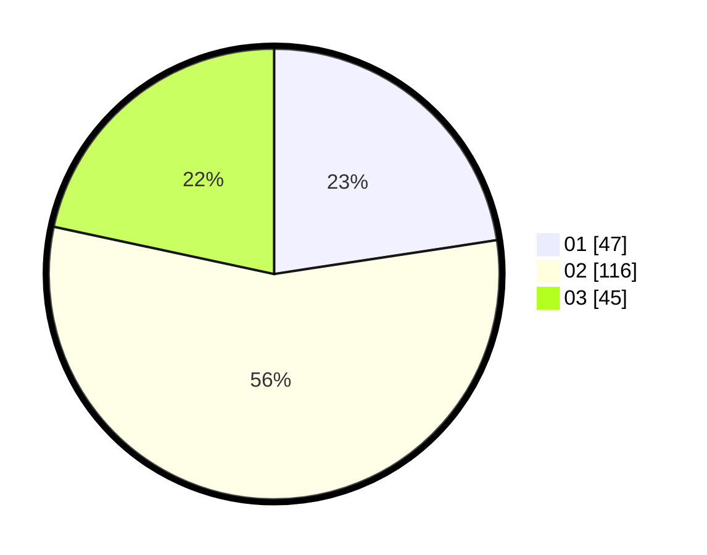

# Hasil

Hasil perolehan suara paslon dapat dilihat pada file paslon-01.txt, paslon-02.txt, dan paslon-03.txt.

Jika tidak ada, artinya data tersebut belum ada pada SIREKAP.

## Perolehan Suara

 * Paslon 01: **47**.
 * Paslon 02: **116**.
 * Paslon 03: **45**.

## Foto C Plano

https://sirekap-obj-formc.kpu.go.id/317f/pemilu/ppwp/31/73/01/10/05/3173011005091-20240214-155833--c3142ac2-36c1-4b57-b1af-4ddc92259f43.jpg

https://sirekap-obj-formc.kpu.go.id/317f/pemilu/ppwp/31/73/01/10/05/3173011005091-20240214-155455--ae1d054b-2d85-4336-bd3a-1a1a1a1c98d1.jpg

https://sirekap-obj-formc.kpu.go.id/317f/pemilu/ppwp/31/73/01/10/05/3173011005091-20240216-050442--d7b787e1-f652-4d85-8564-5bdd50fc631f.jpg

## DATA PEMILIH TETAP

Jumlah pemilih dalam DPT: **212**.
 * L: **104**.
 * P: **108**.

## DATA PENGGUNA HAK PILIH

Jumlah pengguna hak pilih dalam DPT: **212**.
 * L: **104**.
 * P: **108**.

Jumlah pengguna hak pilih dalam DPTb: **0**.
 * L: **0**.
 * P: **0**.

Jumlah pengguna hak pilih dalam DPK: **0**.
 * L: **0**.
 * P: **0**.

Jumlah pengguna hak pilih: **212**.
 * L: **104**.
 * P: **108**.

## JUMLAH SUARA SAH DAN TIDAK SAH

JUMLAH SELURUH SUARA SAH: **208**.

JUMLAH SUARA TIDAK SAH: **4**.

JUMLAH SELURUH SUARA SAH DAN SUARA TIDAK SAH: **212**.
