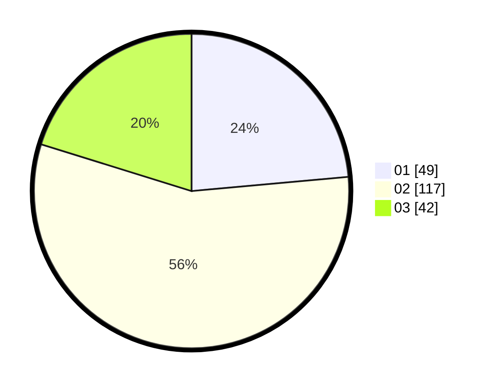

# Hasil

Hasil perolehan suara paslon dapat dilihat pada file paslon-01.txt, paslon-02.txt, dan paslon-03.txt.

Jika tidak ada, artinya data tersebut belum ada pada SIREKAP.

## Perolehan Suara

 * Paslon 01: **49**.
 * Paslon 02: **117**.
 * Paslon 03: **42**.

## Foto C Plano

https://sirekap-obj-formc.kpu.go.id/03c9/pemilu/ppwp/31/73/01/10/05/3173011005092-20240214-205907--24737095-830b-4ceb-8246-65f110ae6911.jpg

https://sirekap-obj-formc.kpu.go.id/03c9/pemilu/ppwp/31/73/01/10/05/3173011005092-20240214-210003--6c33c812-76d2-4072-bf8d-9ea3e68effa9.jpg

https://sirekap-obj-formc.kpu.go.id/03c9/pemilu/ppwp/31/73/01/10/05/3173011005092-20240214-210057--0bec2606-4212-4c03-9a98-0c83baec108b.jpg

## DATA PEMILIH TETAP

Jumlah pemilih dalam DPT: **265**.
 * L: **132**.
 * P: **133**.

## DATA PENGGUNA HAK PILIH

Jumlah pengguna hak pilih dalam DPT: **207**.
 * L: **99**.
 * P: **108**.

Jumlah pengguna hak pilih dalam DPTb: **0**.
 * L: **0**.
 * P: **0**.

Jumlah pengguna hak pilih dalam DPK: **0**.
 * L: **0**.
 * P: **0**.

Jumlah pengguna hak pilih: **207**.
 * L: **99**.
 * P: **108**.

## JUMLAH SUARA SAH DAN TIDAK SAH

JUMLAH SELURUH SUARA SAH: **204**.

JUMLAH SUARA TIDAK SAH: **3**.

JUMLAH SELURUH SUARA SAH DAN SUARA TIDAK SAH: **207**.
