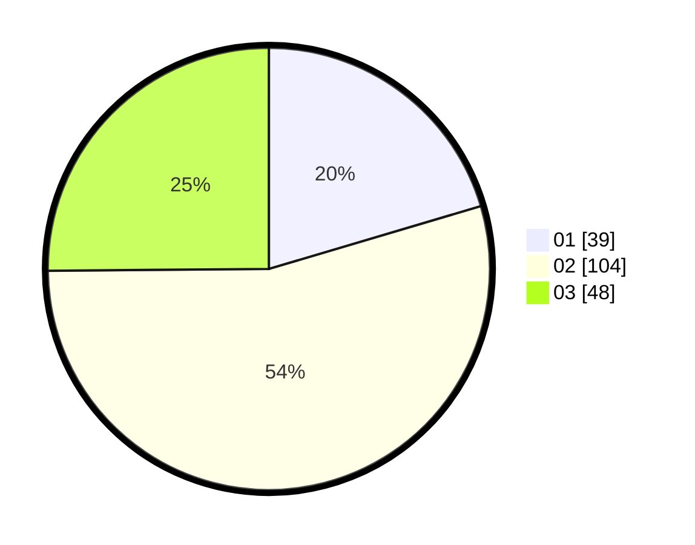

# Hasil

Hasil perolehan suara paslon dapat dilihat pada file paslon-01.txt, paslon-02.txt, dan paslon-03.txt.

Jika tidak ada, artinya data tersebut belum ada pada SIREKAP.

## Perolehan Suara

 * Paslon 01: **39**.
 * Paslon 02: **104**.
 * Paslon 03: **48**.

## Foto C Plano

https://sirekap-obj-formc.kpu.go.id/6ac3/pemilu/ppwp/31/73/01/10/05/3173011005094-20240214-155618--11b68085-a5c2-4c54-8ab2-e84ef7a6e37d.jpg

https://sirekap-obj-formc.kpu.go.id/6ac3/pemilu/ppwp/31/73/01/10/05/3173011005094-20240214-155342--c2cd4639-386c-4b1c-9111-36eaa2ad05d6.jpg

https://sirekap-obj-formc.kpu.go.id/6ac3/pemilu/ppwp/31/73/01/10/05/3173011005094-20240214-155350--2971aa16-f270-46c6-b639-e52c5b25a9ab.jpg

## DATA PEMILIH TETAP

Jumlah pemilih dalam DPT: **271**.
 * L: **134**.
 * P: **137**.

## DATA PENGGUNA HAK PILIH

Jumlah pengguna hak pilih dalam DPT: **193**.
 * L: **94**.
 * P: **99**.

Jumlah pengguna hak pilih dalam DPTb: **0**.
 * L: **0**.
 * P: **0**.

Jumlah pengguna hak pilih dalam DPK: **0**.
 * L: **0**.
 * P: **0**.

Jumlah pengguna hak pilih: **193**.
 * L: **94**.
 * P: **99**.

## JUMLAH SUARA SAH DAN TIDAK SAH

JUMLAH SELURUH SUARA SAH: **191**.

JUMLAH SUARA TIDAK SAH: **2**.

JUMLAH SELURUH SUARA SAH DAN SUARA TIDAK SAH: **193**.
