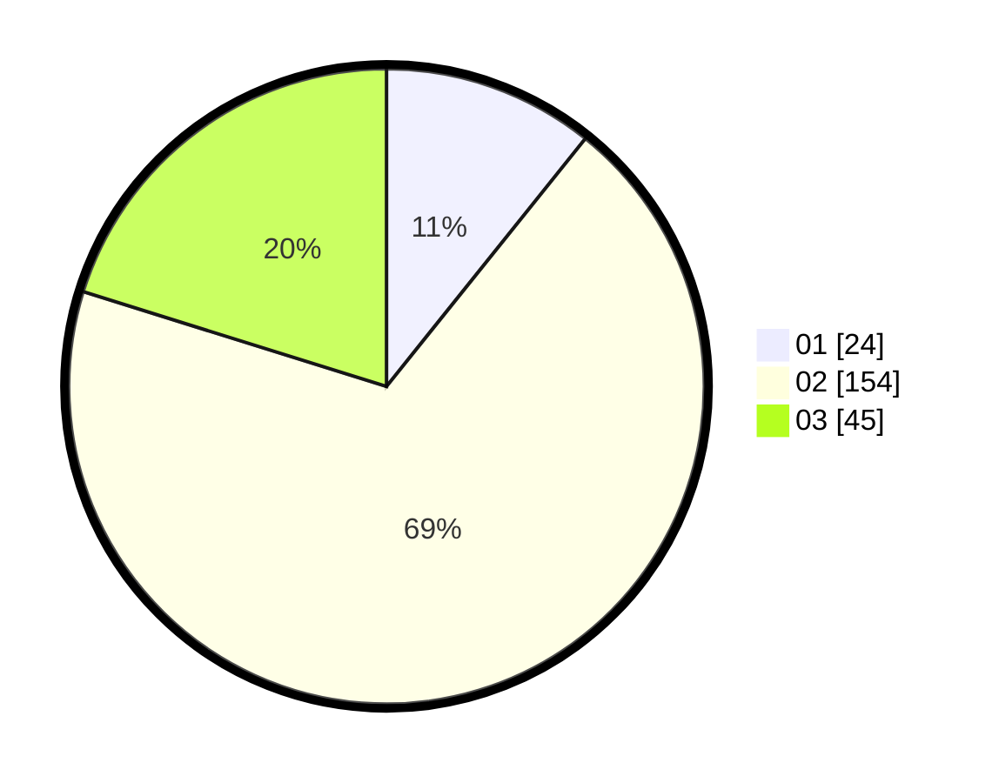

# Hasil

Hasil perolehan suara paslon dapat dilihat pada file paslon-01.txt, paslon-02.txt, dan paslon-03.txt.

Jika tidak ada, artinya data tersebut belum ada pada SIREKAP.

## Perolehan Suara

 * Paslon 01: **24**.
 * Paslon 02: **154**.
 * Paslon 03: **45**.

## Foto C Plano

https://sirekap-obj-formc.kpu.go.id/3d47/pemilu/ppwp/31/73/01/10/05/3173011005100-20240215-000658--ca4c074c-a907-47cb-bfbb-c08ada3f6643.jpg

https://sirekap-obj-formc.kpu.go.id/3d47/pemilu/ppwp/31/73/01/10/05/3173011005100-20240215-000707--60a955e3-b56a-46ee-b85c-dd7ed53cfdac.jpg

https://sirekap-obj-formc.kpu.go.id/3d47/pemilu/ppwp/31/73/01/10/05/3173011005100-20240215-000728--02d93aa4-0095-477c-8786-e3b30a806def.jpg
