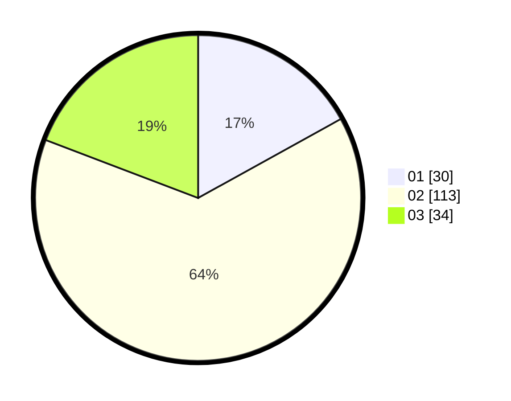

# Hasil

Hasil perolehan suara paslon dapat dilihat pada file paslon-01.txt, paslon-02.txt, dan paslon-03.txt.

Jika tidak ada, artinya data tersebut belum ada pada SIREKAP.

## Perolehan Suara

 * Paslon 01: **30**.
 * Paslon 02: **113**.
 * Paslon 03: **34**.

## Foto C Plano

https://sirekap-obj-formc.kpu.go.id/b00c/pemilu/ppwp/31/73/01/10/05/3173011005107-20240214-232516--69e64c7f-0b84-45ea-994a-010bb3be8547.jpg

https://sirekap-obj-formc.kpu.go.id/b00c/pemilu/ppwp/31/73/01/10/05/3173011005107-20240214-232545--53092a19-a941-47c2-95cf-5783c4a2d40d.jpg

https://sirekap-obj-formc.kpu.go.id/b00c/pemilu/ppwp/31/73/01/10/05/3173011005107-20240214-232613--1d19193a-1ab1-4b01-9fc9-d160e099c742.jpg
