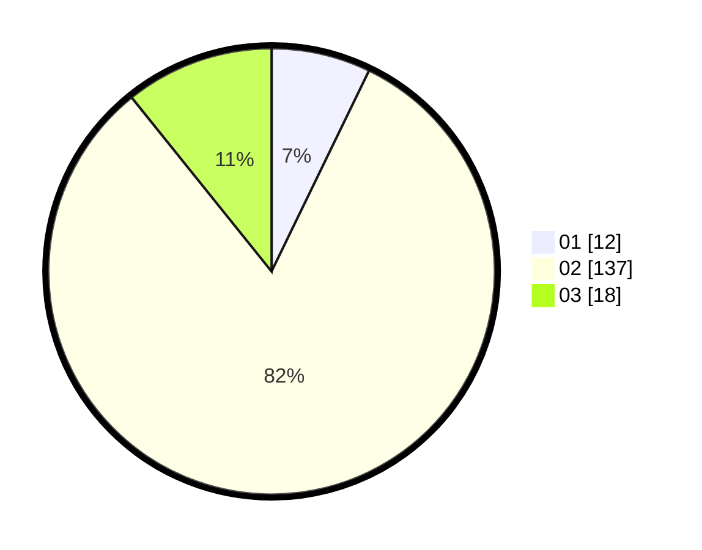

# Hasil

Hasil perolehan suara paslon dapat dilihat pada file paslon-01.txt, paslon-02.txt, dan paslon-03.txt.

Jika tidak ada, artinya data tersebut belum ada pada SIREKAP.

## Perolehan Suara

 * Paslon 01: **12**.
 * Paslon 02: **137**.
 * Paslon 03: **18**.

## Foto C Plano

https://sirekap-obj-formc.kpu.go.id/af43/pemilu/ppwp/31/73/01/10/05/3173011005108-20240214-225742--86f2bce6-ab6c-487f-b312-ca01acf31e8c.jpg

https://sirekap-obj-formc.kpu.go.id/af43/pemilu/ppwp/31/73/01/10/05/3173011005108-20240214-225908--328ecfff-2bb6-40b2-a9cd-46d38cdacda5.jpg

https://sirekap-obj-formc.kpu.go.id/af43/pemilu/ppwp/31/73/01/10/05/3173011005108-20240214-230041--7940ff02-69bd-4770-a695-294f450d750a.jpg

## DATA PEMILIH TETAP

Jumlah pemilih dalam DPT: **278**.
 * L: **139**.
 * P: **139**.

## DATA PENGGUNA HAK PILIH

Jumlah pengguna hak pilih dalam DPT: **170**.
 * L: **80**.
 * P: **90**.

Jumlah pengguna hak pilih dalam DPTb: **0**.
 * L: **0**.
 * P: **0**.

Jumlah pengguna hak pilih dalam DPK: **0**.
 * L: **0**.
 * P: **0**.

Jumlah pengguna hak pilih: **170**.
 * L: **80**.
 * P: **90**.

## JUMLAH SUARA SAH DAN TIDAK SAH

JUMLAH SELURUH SUARA SAH: **167**.

JUMLAH SUARA TIDAK SAH: **3**.

JUMLAH SELURUH SUARA SAH DAN SUARA TIDAK SAH: **170**.
