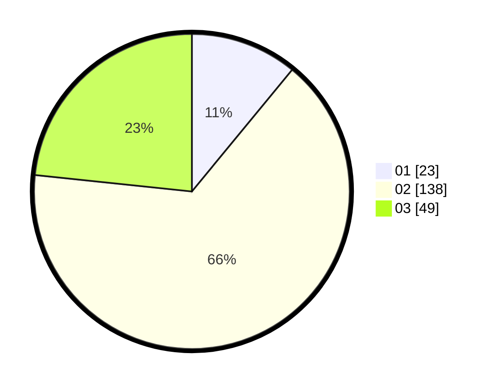

# Hasil

Hasil perolehan suara paslon dapat dilihat pada file paslon-01.txt, paslon-02.txt, dan paslon-03.txt.

Jika tidak ada, artinya data tersebut belum ada pada SIREKAP.

## Perolehan Suara

 * Paslon 01: **23**.
 * Paslon 02: **138**.
 * Paslon 03: **49**.

## Foto C Plano

https://sirekap-obj-formc.kpu.go.id/4e54/pemilu/ppwp/31/73/01/10/05/3173011005109-20240214-200616--def9fdb0-5c68-42cb-939a-9980890105d6.jpg

https://sirekap-obj-formc.kpu.go.id/4e54/pemilu/ppwp/31/73/01/10/05/3173011005109-20240215-010304--052b4bbf-32a6-4be6-8a38-2c40802d6bbd.jpg

https://sirekap-obj-formc.kpu.go.id/4e54/pemilu/ppwp/31/73/01/10/05/3173011005109-20240214-200843--9ff399cc-c9ef-4cf7-a1be-afdef2cf698a.jpg

## DATA PEMILIH TETAP

Jumlah pemilih dalam DPT: **273**.
 * L: **138**.
 * P: **135**.

## DATA PENGGUNA HAK PILIH

Jumlah pengguna hak pilih dalam DPT: **209**.
 * L: **101**.
 * P: **108**.

Jumlah pengguna hak pilih dalam DPTb: **0**.
 * L: **0**.
 * P: **0**.

Jumlah pengguna hak pilih dalam DPK: **3**.
 * L: **2**.
 * P: **1**.

Jumlah pengguna hak pilih: **212**.
 * L: **103**.
 * P: **109**.

## JUMLAH SUARA SAH DAN TIDAK SAH

JUMLAH SELURUH SUARA SAH: **210**.

JUMLAH SUARA TIDAK SAH: **2**.

JUMLAH SELURUH SUARA SAH DAN SUARA TIDAK SAH: **212**.
