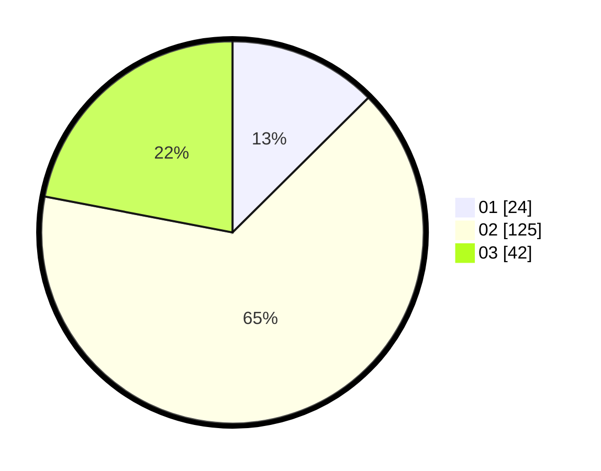

# Hasil

Hasil perolehan suara paslon dapat dilihat pada file paslon-01.txt, paslon-02.txt, dan paslon-03.txt.

Jika tidak ada, artinya data tersebut belum ada pada SIREKAP.

## Perolehan Suara

 * Paslon 01: **24**.
 * Paslon 02: **125**.
 * Paslon 03: **42**.

## Foto C Plano

https://sirekap-obj-formc.kpu.go.id/07ec/pemilu/ppwp/31/73/01/10/05/3173011005110-20240214-191935--18a0a2fb-229e-4195-9c7d-d0355bb2d7cd.jpg

https://sirekap-obj-formc.kpu.go.id/07ec/pemilu/ppwp/31/73/01/10/05/3173011005110-20240214-192122--74827dc4-7671-41a5-bba9-ef2027994cfd.jpg

https://sirekap-obj-formc.kpu.go.id/07ec/pemilu/ppwp/31/73/01/10/05/3173011005110-20240214-192208--3857f8fd-90dd-49ae-bc14-66f42fa8aea8.jpg

## DATA PEMILIH TETAP

Jumlah pemilih dalam DPT: **277**.
 * L: **137**.
 * P: **140**.

## DATA PENGGUNA HAK PILIH

Jumlah pengguna hak pilih dalam DPT: **189**.
 * L: **89**.
 * P: **100**.

Jumlah pengguna hak pilih dalam DPTb: **2**.
 * L: **0**.
 * P: **2**.

Jumlah pengguna hak pilih dalam DPK: **2**.
 * L: **0**.
 * P: **2**.

Jumlah pengguna hak pilih: **193**.
 * L: **89**.
 * P: **104**.

## JUMLAH SUARA SAH DAN TIDAK SAH

JUMLAH SELURUH SUARA SAH: **191**.

JUMLAH SUARA TIDAK SAH: **2**.

JUMLAH SELURUH SUARA SAH DAN SUARA TIDAK SAH: **193**.
