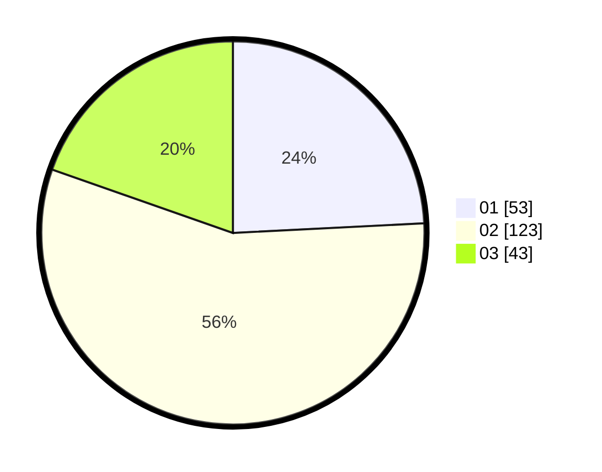

# Hasil

Hasil perolehan suara paslon dapat dilihat pada file paslon-01.txt, paslon-02.txt, dan paslon-03.txt.

Jika tidak ada, artinya data tersebut belum ada pada SIREKAP.

## Perolehan Suara

 * Paslon 01: **53**.
 * Paslon 02: **123**.
 * Paslon 03: **43**.

## Foto C Plano

https://sirekap-obj-formc.kpu.go.id/71dc/pemilu/ppwp/31/73/01/10/05/3173011005111-20240215-001518--2a0632f2-33f4-44cc-9dae-8e075633f586.jpg

https://sirekap-obj-formc.kpu.go.id/71dc/pemilu/ppwp/31/73/01/10/05/3173011005111-20240215-001726--c6bc36e2-6f72-4d33-93df-dc7a6c0a3901.jpg

https://sirekap-obj-formc.kpu.go.id/71dc/pemilu/ppwp/31/73/01/10/05/3173011005111-20240215-002022--299b8adc-8dd7-49fe-9f44-ef8b766291a5.jpg
