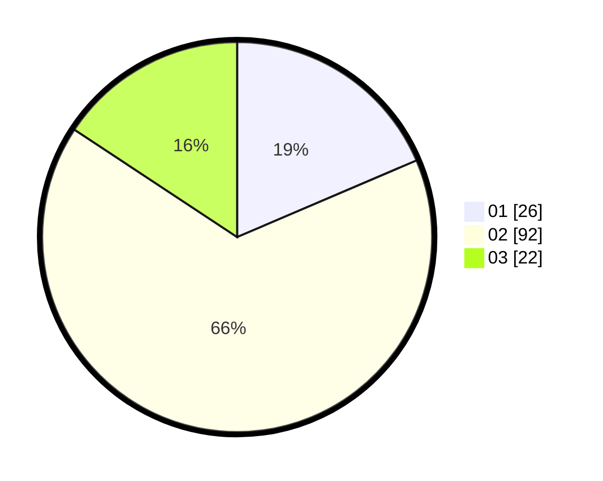

# Hasil

Hasil perolehan suara paslon dapat dilihat pada file paslon-01.txt, paslon-02.txt, dan paslon-03.txt.

Jika tidak ada, artinya data tersebut belum ada pada SIREKAP.

## Perolehan Suara

 * Paslon 01: **26**.
 * Paslon 02: **92**.
 * Paslon 03: **22**.

## Foto C Plano

https://sirekap-obj-formc.kpu.go.id/5cb0/pemilu/ppwp/31/73/01/10/05/3173011005113-20240214-224543--093331ea-1f26-4781-8e89-3b7a4a1d8984.jpg

https://sirekap-obj-formc.kpu.go.id/5cb0/pemilu/ppwp/31/73/01/10/05/3173011005113-20240214-224624--f29aa119-3b9f-4e52-b0d5-e5f4ca9fc020.jpg

https://sirekap-obj-formc.kpu.go.id/5cb0/pemilu/ppwp/31/73/01/10/05/3173011005113-20240214-204825--1046774d-950c-4172-b417-790dc5640fc8.jpg
