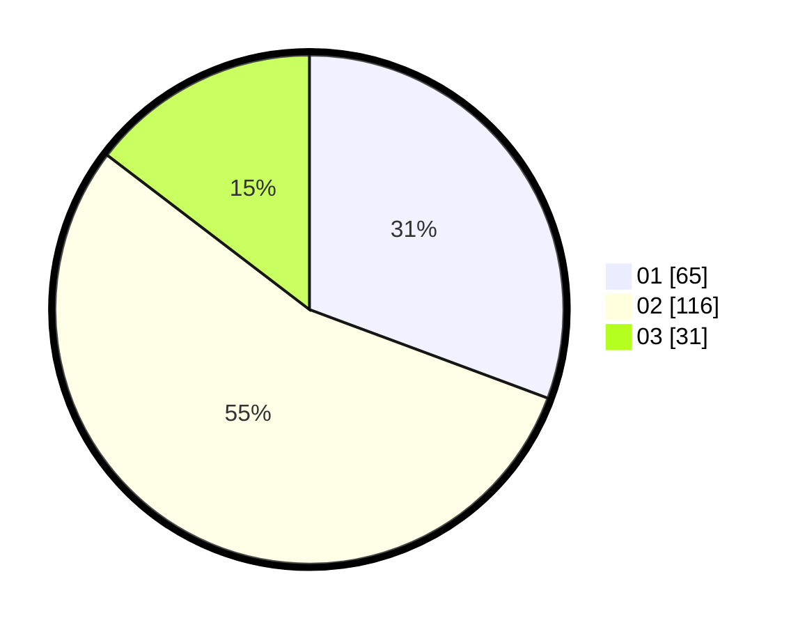

# Hasil

Hasil perolehan suara paslon dapat dilihat pada file paslon-01.txt, paslon-02.txt, dan paslon-03.txt.

Jika tidak ada, artinya data tersebut belum ada pada SIREKAP.

## Perolehan Suara

 * Paslon 01: **65**.
 * Paslon 02: **116**.
 * Paslon 03: **31**.

## Foto C Plano

https://sirekap-obj-formc.kpu.go.id/1dd1/pemilu/ppwp/31/73/01/10/05/3173011005114-20240214-184451--16187cbc-dcb2-4455-a334-bfd185ed82ab.jpg

https://sirekap-obj-formc.kpu.go.id/1dd1/pemilu/ppwp/31/73/01/10/05/3173011005114-20240214-185524--128442f3-174a-4283-bee8-0a199b80f18c.jpg

https://sirekap-obj-formc.kpu.go.id/1dd1/pemilu/ppwp/31/73/01/10/05/3173011005114-20240214-185147--f3ee162c-bf59-4ef1-8162-e4161ba46eb7.jpg

## DATA PEMILIH TETAP

Jumlah pemilih dalam DPT: **272**.
 * L: **142**.
 * P: **130**.

## DATA PENGGUNA HAK PILIH

Jumlah pengguna hak pilih dalam DPT: **211**.
 * L: **157**.
 * P: **104**.

Jumlah pengguna hak pilih dalam DPTb: **0**.
 * L: **0**.
 * P: **0**.

Jumlah pengguna hak pilih dalam DPK: **3**.
 * L: **2**.
 * P: **1**.

Jumlah pengguna hak pilih: **214**.
 * L: **109**.
 * P: **105**.

## JUMLAH SUARA SAH DAN TIDAK SAH

JUMLAH SELURUH SUARA SAH: **212**.

JUMLAH SUARA TIDAK SAH: **2**.

JUMLAH SELURUH SUARA SAH DAN SUARA TIDAK SAH: **314**.
