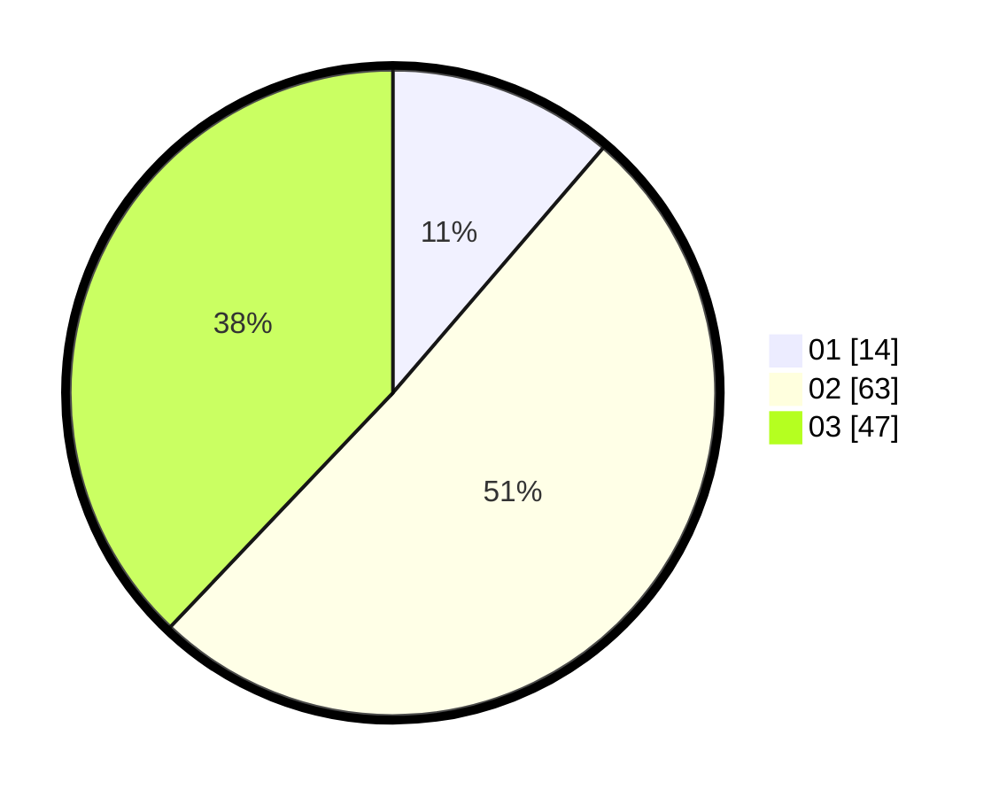

# Hasil

Hasil perolehan suara paslon dapat dilihat pada file paslon-01.txt, paslon-02.txt, dan paslon-03.txt.

Jika tidak ada, artinya data tersebut belum ada pada SIREKAP.

## Perolehan Suara

 * Paslon 01: **14**.
 * Paslon 02: **63**.
 * Paslon 03: **47**.

## Foto C Plano

https://sirekap-obj-formc.kpu.go.id/4457/pemilu/ppwp/31/73/01/10/05/3173011005115-20240214-212120--0dfc37dd-510a-4de4-b0aa-54d7b4f7166d.jpg

https://sirekap-obj-formc.kpu.go.id/4457/pemilu/ppwp/31/73/01/10/05/3173011005115-20240214-224738--7164ea45-0d95-40ff-b269-14c837b4dd4c.jpg

https://sirekap-obj-formc.kpu.go.id/4457/pemilu/ppwp/31/73/01/10/05/3173011005115-20240214-224922--7787ddce-43f3-4397-b49c-444f86771474.jpg

## DATA PEMILIH TETAP

Jumlah pemilih dalam DPT: **144**.
 * L: **77**.
 * P: **67**.

## DATA PENGGUNA HAK PILIH

Jumlah pengguna hak pilih dalam DPT: **97**.
 * L: **49**.
 * P: **48**.

Jumlah pengguna hak pilih dalam DPTb: **0**.
 * L: **0**.
 * P: **0**.

Jumlah pengguna hak pilih dalam DPK: **0**.
 * L: **0**.
 * P: **0**.

Jumlah pengguna hak pilih: **97**.
 * L: **49**.
 * P: **48**.

## JUMLAH SUARA SAH DAN TIDAK SAH

JUMLAH SELURUH SUARA SAH: **94**.

JUMLAH SUARA TIDAK SAH: **3**.

JUMLAH SELURUH SUARA SAH DAN SUARA TIDAK SAH: **97**.
