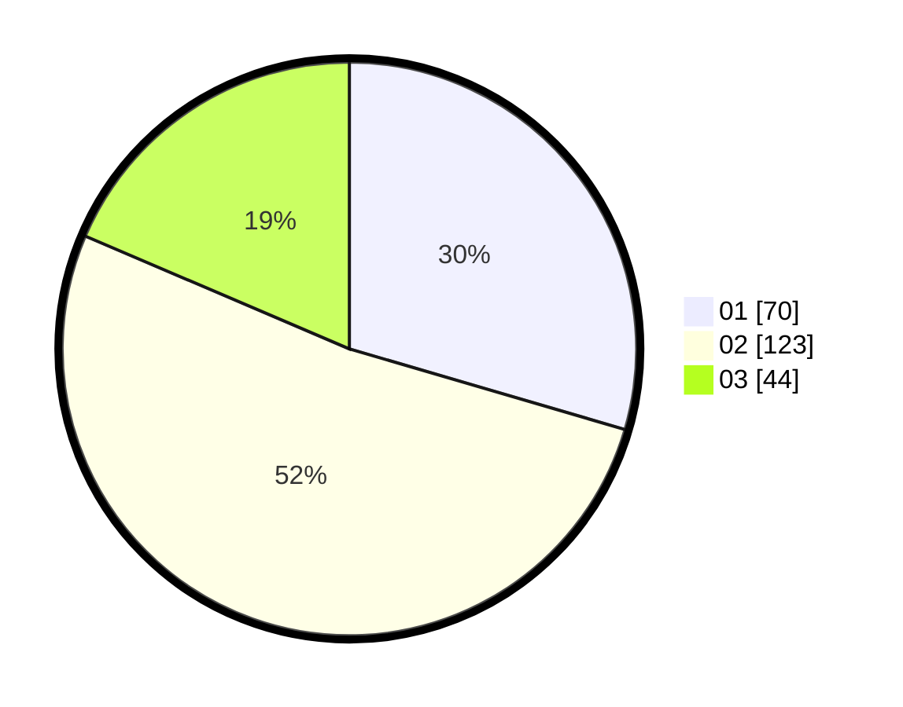

# Hasil

Hasil perolehan suara paslon dapat dilihat pada file paslon-01.txt, paslon-02.txt, dan paslon-03.txt.

Jika tidak ada, artinya data tersebut belum ada pada SIREKAP.

## Perolehan Suara

 * Paslon 01: **70**.
 * Paslon 02: **123**.
 * Paslon 03: **44**.

## Foto C Plano

https://sirekap-obj-formc.kpu.go.id/c89b/pemilu/ppwp/31/73/01/10/05/3173011005120-20240216-092345--2863cbad-0d5d-4cd4-88d1-66b599fc712d.jpg

https://sirekap-obj-formc.kpu.go.id/c89b/pemilu/ppwp/31/73/01/10/05/3173011005120-20240216-100349--c9147a87-4f1f-44b1-8749-6eb2844b7101.jpg

https://sirekap-obj-formc.kpu.go.id/c89b/pemilu/ppwp/31/73/01/10/05/3173011005120-20240216-092354--907c9556-98f3-4739-a09a-cc3d2c494c0e.jpg

## DATA PEMILIH TETAP

Jumlah pemilih dalam DPT: **285**.
 * L: **153**.
 * P: **132**.

## DATA PENGGUNA HAK PILIH

Jumlah pengguna hak pilih dalam DPT: **241**.
 * L: **125**.
 * P: **116**.

Jumlah pengguna hak pilih dalam DPTb: **0**.
 * L: **0**.
 * P: **0**.

Jumlah pengguna hak pilih dalam DPK: **0**.
 * L: **0**.
 * P: **0**.

Jumlah pengguna hak pilih: **241**.
 * L: **125**.
 * P: **116**.

## JUMLAH SUARA SAH DAN TIDAK SAH

JUMLAH SELURUH SUARA SAH: **237**.

JUMLAH SUARA TIDAK SAH: **4**.

JUMLAH SELURUH SUARA SAH DAN SUARA TIDAK SAH: **241**.
