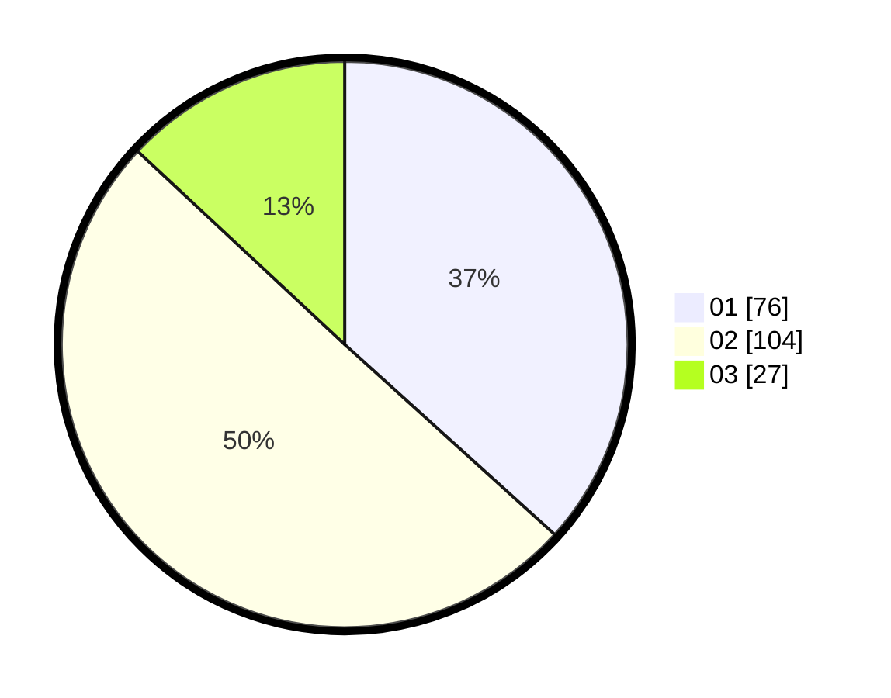

# Hasil

Hasil perolehan suara paslon dapat dilihat pada file paslon-01.txt, paslon-02.txt, dan paslon-03.txt.

Jika tidak ada, artinya data tersebut belum ada pada SIREKAP.

## Perolehan Suara

 * Paslon 01: **76**.
 * Paslon 02: **104**.
 * Paslon 03: **27**.

## Foto C Plano

https://sirekap-obj-formc.kpu.go.id/7cc6/pemilu/ppwp/31/73/01/10/05/3173011005122-20240214-195547--e254cd30-068c-4ea4-8f4e-faeef3926cf5.jpg

https://sirekap-obj-formc.kpu.go.id/7cc6/pemilu/ppwp/31/73/01/10/05/3173011005122-20240214-195812--47118c7b-165a-466e-9a24-ee6889f9d585.jpg

https://sirekap-obj-formc.kpu.go.id/7cc6/pemilu/ppwp/31/73/01/10/05/3173011005122-20240214-200018--979da8af-a6ce-488a-8dcd-d3602a15dfce.jpg

## DATA PEMILIH TETAP

Jumlah pemilih dalam DPT: **730**.
 * L: **142**.
 * P: **132**.

## DATA PENGGUNA HAK PILIH

Jumlah pengguna hak pilih dalam DPT: **206**.
 * L: **102**.
 * P: **104**.

Jumlah pengguna hak pilih dalam DPTb: **2**.
 * L: **1**.
 * P: **1**.

Jumlah pengguna hak pilih dalam DPK: **5**.
 * L: **0**.
 * P: **5**.

Jumlah pengguna hak pilih: **213**.
 * L: **103**.
 * P: **117**.

## JUMLAH SUARA SAH DAN TIDAK SAH

JUMLAH SELURUH SUARA SAH: **207**.

JUMLAH SUARA TIDAK SAH: **6**.

JUMLAH SELURUH SUARA SAH DAN SUARA TIDAK SAH: **213**.
