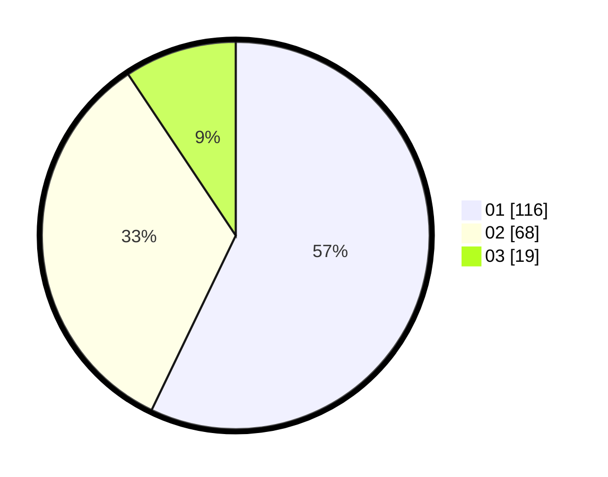

# Hasil

Hasil perolehan suara paslon dapat dilihat pada file paslon-01.txt, paslon-02.txt, dan paslon-03.txt.

Jika tidak ada, artinya data tersebut belum ada pada SIREKAP.

## Perolehan Suara

 * Paslon 01: **116**.
 * Paslon 02: **68**.
 * Paslon 03: **19**.

## Foto C Plano

https://sirekap-obj-formc.kpu.go.id/54b8/pemilu/ppwp/31/73/01/10/05/3173011005125-20240215-213700--a5ed5bb2-fba2-4ced-8b66-04be031f9989.jpg

https://sirekap-obj-formc.kpu.go.id/54b8/pemilu/ppwp/31/73/01/10/05/3173011005125-20240215-213702--1ec84736-2724-4888-8e36-1a94c0e89b72.jpg

https://sirekap-obj-formc.kpu.go.id/54b8/pemilu/ppwp/31/73/01/10/05/3173011005125-20240215-213701--5893caaf-6324-4f8e-84a8-3b28965b930c.jpg

## DATA PEMILIH TETAP

Jumlah pemilih dalam DPT: **245**.
 * L: **121**.
 * P: **124**.

## DATA PENGGUNA HAK PILIH

Jumlah pengguna hak pilih dalam DPT: **201**.
 * L: **95**.
 * P: **106**.

Jumlah pengguna hak pilih dalam DPTb: **0**.
 * L: **0**.
 * P: **0**.

Jumlah pengguna hak pilih dalam DPK: **4**.
 * L: **1**.
 * P: **3**.

Jumlah pengguna hak pilih: **205**.
 * L: **96**.
 * P: **109**.

## JUMLAH SUARA SAH DAN TIDAK SAH

JUMLAH SELURUH SUARA SAH: **203**.

JUMLAH SUARA TIDAK SAH: **2**.

JUMLAH SELURUH SUARA SAH DAN SUARA TIDAK SAH: **205**.
