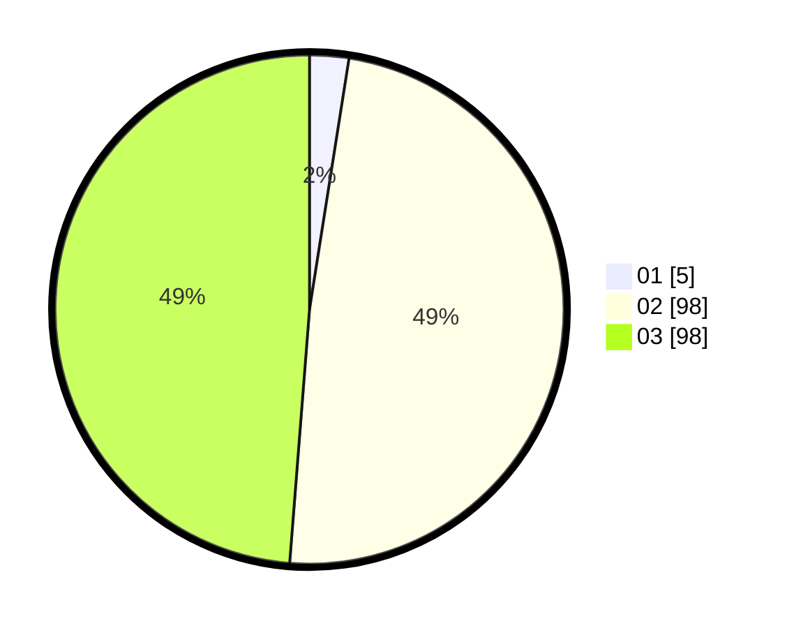

# Hasil

Hasil perolehan suara paslon dapat dilihat pada file paslon-01.txt, paslon-02.txt, dan paslon-03.txt.

Jika tidak ada, artinya data tersebut belum ada pada SIREKAP.

## Perolehan Suara

 * Paslon 01: **5**.
 * Paslon 02: **98**.
 * Paslon 03: **98**.

## Foto C Plano

https://sirekap-obj-formc.kpu.go.id/91d9/pemilu/ppwp/31/73/01/10/05/3173011005128-20240214-225451--14522fc8-ea5b-4150-9c31-864bd765f050.jpg

https://sirekap-obj-formc.kpu.go.id/91d9/pemilu/ppwp/31/73/01/10/05/3173011005128-20240214-225715--060bd750-7571-47fc-be4e-aa36c659d481.jpg

https://sirekap-obj-formc.kpu.go.id/91d9/pemilu/ppwp/31/73/01/10/05/3173011005128-20240214-225827--447fd199-0aa1-487c-b14d-5099ad9be72b.jpg
