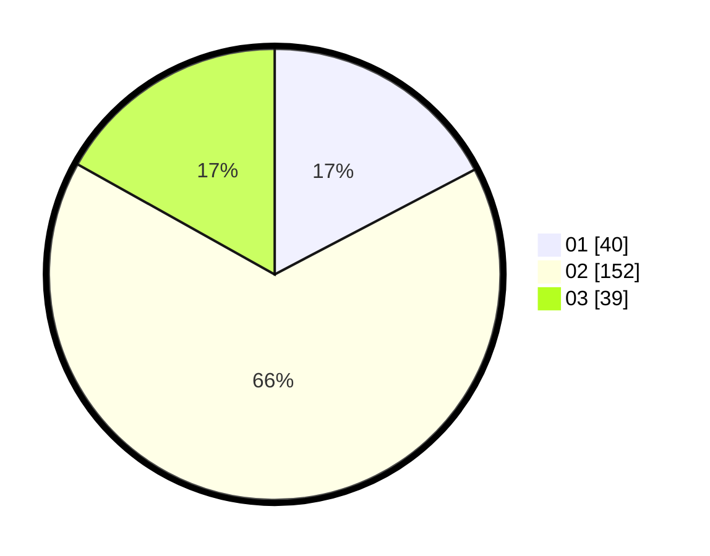

# Hasil

Hasil perolehan suara paslon dapat dilihat pada file paslon-01.txt, paslon-02.txt, dan paslon-03.txt.

Jika tidak ada, artinya data tersebut belum ada pada SIREKAP.

## Perolehan Suara

 * Paslon 01: **40**.
 * Paslon 02: **152**.
 * Paslon 03: **39**.

## Foto C Plano

https://sirekap-obj-formc.kpu.go.id/a673/pemilu/ppwp/31/73/01/10/05/3173011005129-20240214-184705--e5a4b73a-31c5-42f0-b158-c7cd8695e1a3.jpg

https://sirekap-obj-formc.kpu.go.id/a673/pemilu/ppwp/31/73/01/10/05/3173011005129-20240216-210624--625276ea-1ef2-41c3-a38b-9635a7d5d8f2.jpg

https://sirekap-obj-formc.kpu.go.id/a673/pemilu/ppwp/31/73/01/10/05/3173011005129-20240214-200342--1f34c057-d118-4ced-bd70-441f5232d030.jpg

## DATA PEMILIH TETAP

Jumlah pemilih dalam DPT: **273**.
 * L: **134**.
 * P: **139**.

## DATA PENGGUNA HAK PILIH

Jumlah pengguna hak pilih dalam DPT: **230**.
 * L: **113**.
 * P: **117**.

Jumlah pengguna hak pilih dalam DPTb: **1**.
 * L: **1**.
 * P: **0**.

Jumlah pengguna hak pilih dalam DPK: **2**.
 * L: **2**.
 * P: **0**.

Jumlah pengguna hak pilih: **233**.
 * L: **116**.
 * P: **117**.

## JUMLAH SUARA SAH DAN TIDAK SAH

JUMLAH SELURUH SUARA SAH: **231**.

JUMLAH SUARA TIDAK SAH: **2**.

JUMLAH SELURUH SUARA SAH DAN SUARA TIDAK SAH: **233**.
