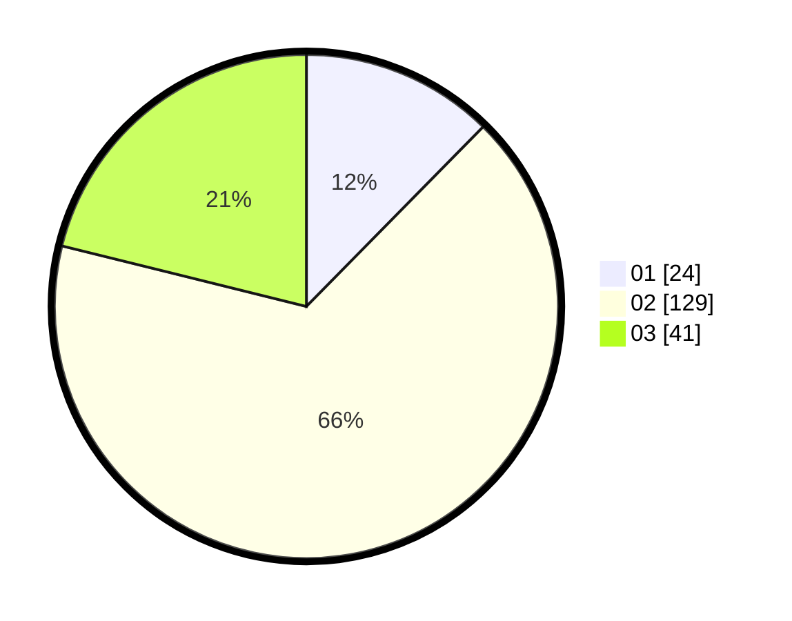

# Hasil

Hasil perolehan suara paslon dapat dilihat pada file paslon-01.txt, paslon-02.txt, dan paslon-03.txt.

Jika tidak ada, artinya data tersebut belum ada pada SIREKAP.

## Perolehan Suara

 * Paslon 01: **24**.
 * Paslon 02: **129**.
 * Paslon 03: **41**.

## Foto C Plano

https://sirekap-obj-formc.kpu.go.id/6290/pemilu/ppwp/31/73/01/10/05/3173011005133-20240216-094930--eada905f-1066-4e37-b056-29c1007c82dc.jpg

https://sirekap-obj-formc.kpu.go.id/6290/pemilu/ppwp/31/73/01/10/05/3173011005133-20240214-184944--27a1fd6c-2a65-4ef0-bc4d-015190c68351.jpg

https://sirekap-obj-formc.kpu.go.id/6290/pemilu/ppwp/31/73/01/10/05/3173011005133-20240214-184753--3e4e5796-e5f2-4883-aa80-a591411ef3d5.jpg

## DATA PEMILIH TETAP

Jumlah pemilih dalam DPT: **277**.
 * L: **150**.
 * P: **127**.

## DATA PENGGUNA HAK PILIH

Jumlah pengguna hak pilih dalam DPT: **193**.
 * L: **99**.
 * P: **94**.

Jumlah pengguna hak pilih dalam DPTb: **3**.
 * L: **0**.
 * P: **3**.

Jumlah pengguna hak pilih dalam DPK: **1**.
 * L: **1**.
 * P: **0**.

Jumlah pengguna hak pilih: **0**.
 * L: **0**.
 * P: **0**.

## JUMLAH SUARA SAH DAN TIDAK SAH

JUMLAH SELURUH SUARA SAH: **194**.

JUMLAH SUARA TIDAK SAH: **3**.

JUMLAH SELURUH SUARA SAH DAN SUARA TIDAK SAH: **197**.
