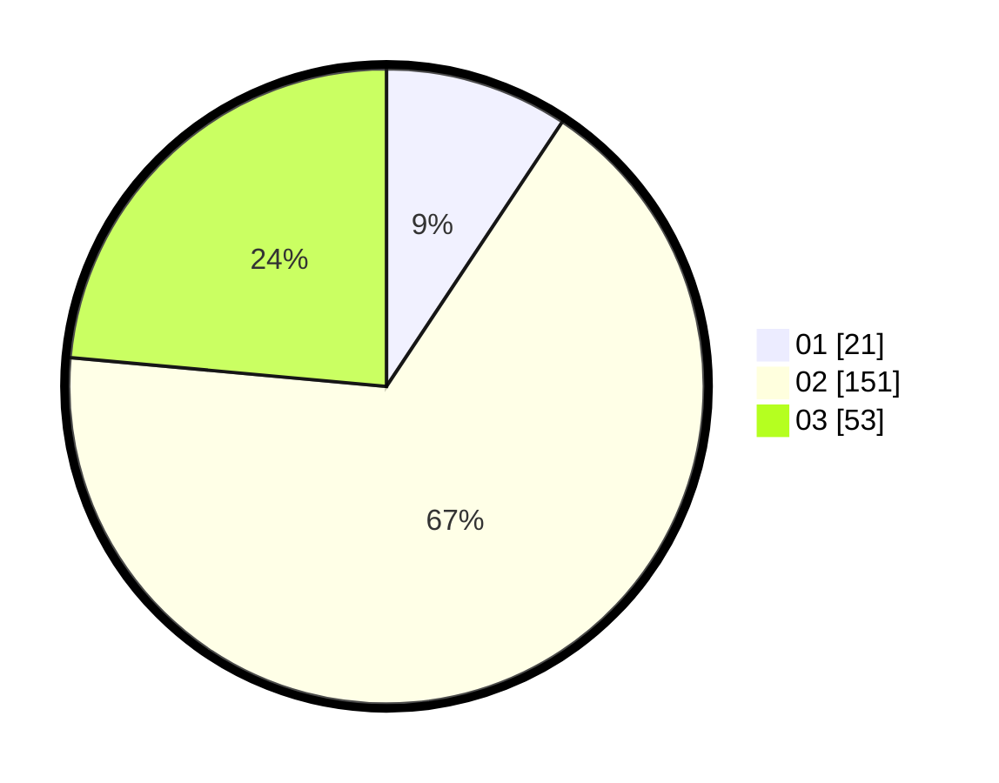

# Hasil

Hasil perolehan suara paslon dapat dilihat pada file paslon-01.txt, paslon-02.txt, dan paslon-03.txt.

Jika tidak ada, artinya data tersebut belum ada pada SIREKAP.

## Perolehan Suara

 * Paslon 01: **21**.
 * Paslon 02: **151**.
 * Paslon 03: **53**.

## Foto C Plano

https://sirekap-obj-formc.kpu.go.id/61c0/pemilu/ppwp/31/73/01/10/05/3173011005134-20240214-191112--f3ccc0c5-02f9-4271-9596-a854da8cd4af.jpg

https://sirekap-obj-formc.kpu.go.id/61c0/pemilu/ppwp/31/73/01/10/05/3173011005134-20240214-191230--e54b9e81-120b-4854-a495-903cc6cef679.jpg

https://sirekap-obj-formc.kpu.go.id/61c0/pemilu/ppwp/31/73/01/10/05/3173011005134-20240214-191326--7fd6722a-71d6-4ebe-8178-3a96e99886bf.jpg

## DATA PEMILIH TETAP

Jumlah pemilih dalam DPT: **280**.
 * L: **144**.
 * P: **136**.

## DATA PENGGUNA HAK PILIH

Jumlah pengguna hak pilih dalam DPT: **229**.
 * L: **116**.
 * P: **113**.

Jumlah pengguna hak pilih dalam DPTb: **3**.
 * L: **1**.
 * P: **2**.

Jumlah pengguna hak pilih dalam DPK: **0**.
 * L: **0**.
 * P: **0**.

Jumlah pengguna hak pilih: **232**.
 * L: **117**.
 * P: **115**.

## JUMLAH SUARA SAH DAN TIDAK SAH

JUMLAH SELURUH SUARA SAH: **225**.

JUMLAH SUARA TIDAK SAH: **7**.

JUMLAH SELURUH SUARA SAH DAN SUARA TIDAK SAH: **232**.
