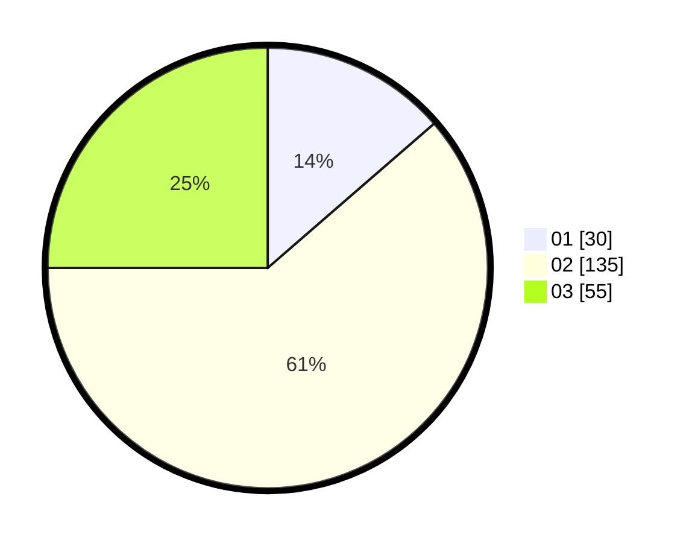

# Hasil

Hasil perolehan suara paslon dapat dilihat pada file paslon-01.txt, paslon-02.txt, dan paslon-03.txt.

Jika tidak ada, artinya data tersebut belum ada pada SIREKAP.

## Perolehan Suara

 * Paslon 01: **30**.
 * Paslon 02: **135**.
 * Paslon 03: **55**.

## Foto C Plano

https://sirekap-obj-formc.kpu.go.id/ba5d/pemilu/ppwp/31/73/01/10/05/3173011005136-20240214-203912--ad54f40c-6d24-41af-938c-bbee47dece68.jpg

https://sirekap-obj-formc.kpu.go.id/ba5d/pemilu/ppwp/31/73/01/10/05/3173011005136-20240214-201629--3f74f8dd-6784-45c8-87e8-b68a5344acff.jpg

https://sirekap-obj-formc.kpu.go.id/ba5d/pemilu/ppwp/31/73/01/10/05/3173011005136-20240214-213627--88ea656b-356c-45cf-a09a-64d39af0d974.jpg
