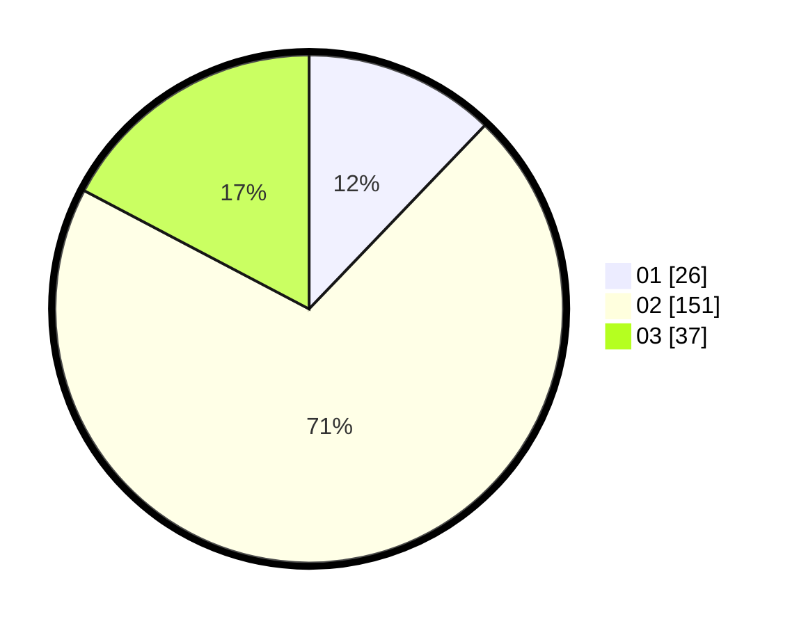

# Hasil

Hasil perolehan suara paslon dapat dilihat pada file paslon-01.txt, paslon-02.txt, dan paslon-03.txt.

Jika tidak ada, artinya data tersebut belum ada pada SIREKAP.

## Perolehan Suara

 * Paslon 01: **26**.
 * Paslon 02: **151**.
 * Paslon 03: **37**.

## Foto C Plano

https://sirekap-obj-formc.kpu.go.id/566e/pemilu/ppwp/31/73/01/10/05/3173011005137-20240214-185111--58649837-33c7-4d72-892a-b8b7a9a420d8.jpg

https://sirekap-obj-formc.kpu.go.id/566e/pemilu/ppwp/31/73/01/10/05/3173011005137-20240214-184604--52e3347c-e691-40dd-981b-cbaaa92a950d.jpg

https://sirekap-obj-formc.kpu.go.id/566e/pemilu/ppwp/31/73/01/10/05/3173011005137-20240214-192106--ad89673e-9a32-4a30-a5d5-28956938fe8d.jpg

## DATA PEMILIH TETAP

Jumlah pemilih dalam DPT: **282**.
 * L: **144**.
 * P: **138**.

## DATA PENGGUNA HAK PILIH

Jumlah pengguna hak pilih dalam DPT: **222**.
 * L: **108**.
 * P: **114**.

Jumlah pengguna hak pilih dalam DPTb: **0**.
 * L: **0**.
 * P: **0**.

Jumlah pengguna hak pilih dalam DPK: **1**.
 * L: **0**.
 * P: **1**.

Jumlah pengguna hak pilih: **223**.
 * L: **0**.
 * P: **0**.

## JUMLAH SUARA SAH DAN TIDAK SAH

JUMLAH SELURUH SUARA SAH: **214**.

JUMLAH SUARA TIDAK SAH: **9**.

JUMLAH SELURUH SUARA SAH DAN SUARA TIDAK SAH: **223**.
